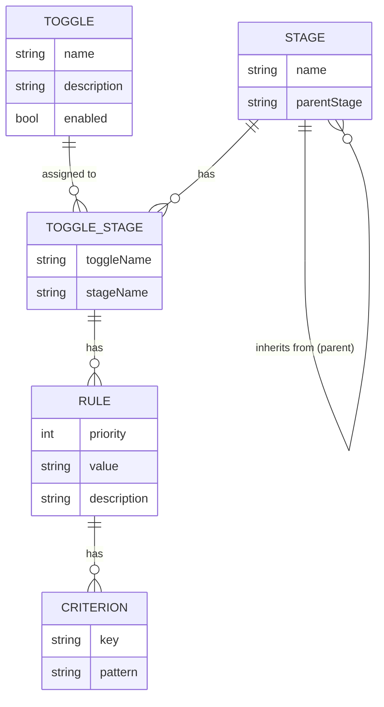

# User Manual

## Using Abstoggle

### Overview

Abstoggle is a feature toggle service. It lets you control which features are active for different environments and user groups — without redeploying your application.

#### Core concepts

- **Toggle** — a named feature flag (e.g. `new-checkout-flow`). A toggle has a description and can be enabled or disabled globally.
- **Stage** — an environment (e.g. `dev`, `test`, `prod`). Stages can inherit from a parent stage, so a toggle configured only for `prod` is automatically available to any stage that inherits from it.
- **Toggle Stage** — a toggle is activated for a stage by assigning it. Only assigned toggle-stage combinations are returned by the public query endpoint.
- **Rule** — defines what value a toggle resolves to for a given set of client attributes. Each rule has:
  - **Priority** (integer, lower = higher priority) — rules are evaluated in ascending priority order; the first match wins.
  - **Value** — the string to return when the rule matches (e.g. `on`, `off`, or any custom string like `variant-b`).
  - **Criteria** — a map of `key → pattern` pairs. The key names a client context attribute; the pattern is tested against the client's value for that attribute. If all criteria match, the rule matches. A rule with no criteria is a catch-all and always matches.



#### Typical workflow

1. Create one or more **Stages** (e.g. `prod`, `test`, `dev` with `test` inheriting from `prod`).
2. Create a **Toggle** and assign it to the relevant stages.
3. Add **Rules** to control what value is returned for different client attributes.
4. Your application calls the public endpoint, evaluates the rules client-side, and gates behaviour on the resolved value.

---

### Evaluation

#### Public endpoint

Your application fetches toggle configuration from the unauthenticated endpoint:

```
GET /public/toggles?stage=<stageName>[&nameFilter=<toggleName>][&includeDisabled=true]
```

| Parameter | Required | Description |
|---|---|---|
| `stage` | Yes | The stage name your application is running in |
| `nameFilter` | No | Return only the named toggle (exact match) |
| `includeDisabled` | No | Include disabled toggles (default: `false`) |

Example response:

```json
{
  "toggles": [
    {
      "name": "new-checkout-flow",
      "stage": "prod",
      "description": "Enables the redesigned checkout",
      "enabled": true,
      "rules": [
        {
          "id": "...",
          "priority": 1,
          "value": "on",
          "description": "EU premium users",
          "criteria": {
            "country": "/^(DE|AT|CH)$/i",
            "plan": "premium"
          }
        },
        {
          "id": "...",
          "priority": 99,
          "value": "off",
          "description": "Default off",
          "criteria": {}
        }
      ]
    }
  ],
  "queryMetadata": {
    "stage": "prod",
    "nameFilter": null,
    "count": 1,
    "cacheHit": false
  }
}
```

The `stage` field on each toggle indicates which stage actually provided the configuration — it may be a parent stage if the requested stage inherits configuration from it.

#### Pattern matching

Criteria values are matched using regular expressions. Two formats are supported:

- **Literal regex string**: `de` — matches if the value contains `de`
- **Slash-delimited with flags**: `/^DE$/i` — standard JS literal notation; `i` makes it case-insensitive

If the pattern is not a valid regex, exact string equality is used as a fallback.

#### Client context

The client context is a flat map of string key-value pairs that your code assembles at runtime. Common attributes include:

```json
{
  "userId": "10042",
  "country": "DE",
  "plan": "premium",
  "userAgent": "Mozilla/5.0 (Macintosh; ...)",
  "region": "eu-west-1",
  "betaUser": "true"
}
```

The keys must match the criterion keys configured in the rules. Any key not present in the context is treated as an empty string when evaluated.

#### Algorithm

Rules are sorted by priority (ascending). For each rule, all criteria are tested against the client context. If all criteria match, that rule's value is returned immediately. If no rule matches, `"off"` is returned.

**JavaScript / TypeScript**

```javascript
function matchesPattern(value, pattern) {
  try {
    const m = /^\/(.+)\/([gimsuy]*)$/.exec(pattern);
    return m ? new RegExp(m[1], m[2]).test(value)
             : new RegExp(pattern).test(value);
  } catch {
    return value === pattern;
  }
}

function evaluate(toggle, clientContext) {
  if (!toggle.enabled) return 'off';

  const rules = [...toggle.rules].sort((a, b) => a.priority - b.priority);

  for (const rule of rules) {
    const criteria = Object.entries(rule.criteria);
    const matches = criteria.length === 0 ||
      criteria.every(([key, pattern]) =>
        matchesPattern(clientContext[key] ?? '', pattern));

    if (matches) return rule.value;
  }
  return 'off';
}

// Usage
const response = await fetch('/public/toggles?stage=prod');
const { toggles } = await response.json();
const context = { userId: '10042', country: 'DE', plan: 'premium' };
const value = evaluate(toggles.find(t => t.name === 'new-checkout-flow'), context);
if (value === 'on') { /* feature active */ }
```

**Java**

```java
import java.util.Map;
import java.util.regex.Pattern;
import java.util.regex.PatternSyntaxException;

public class ToggleEvaluator {

    public static String evaluate(ToggleDto toggle, Map<String, String> clientContext) {
        if (!Boolean.TRUE.equals(toggle.getEnabled())) return "off";

        return toggle.getRules().stream()
            .sorted(Comparator.comparingInt(RuleDto::getPriority))
            .filter(rule -> matchesAll(rule.getCriteria(), clientContext))
            .map(RuleDto::getValue)
            .findFirst()
            .orElse("off");
    }

    private static boolean matchesAll(Map<String, String> criteria, Map<String, String> ctx) {
        return criteria.entrySet().stream().allMatch(e ->
            matchesPattern(ctx.getOrDefault(e.getKey(), ""), e.getValue()));
    }

    private static boolean matchesPattern(String value, String pattern) {
        try {
            if (pattern.startsWith("/")) {
                int last = pattern.lastIndexOf('/');
                if (last > 0) {
                    String regex = pattern.substring(1, last);
                    String flags = pattern.substring(last + 1);
                    int f = flags.contains("i") ? Pattern.CASE_INSENSITIVE : 0;
                    return Pattern.compile(regex, f).matcher(value).find();
                }
            }
            return Pattern.compile(pattern).matcher(value).find();
        } catch (PatternSyntaxException e) {
            return value.equals(pattern);
        }
    }
}
```

**Python**

```python
import re
import requests

def matches_pattern(value: str, pattern: str) -> bool:
    try:
        if pattern.startswith('/'):
            last = pattern.rfind('/')
            if last > 0:
                regex = pattern[1:last]
                flags_str = pattern[last+1:]
                flags = re.IGNORECASE if 'i' in flags_str else 0
                return bool(re.search(regex, value, flags))
        return bool(re.search(pattern, value))
    except re.error:
        return value == pattern

def evaluate(toggle: dict, client_context: dict) -> str:
    if not toggle.get('enabled', False):
        return 'off'
    rules = sorted(toggle.get('rules', []), key=lambda r: r['priority'])
    for rule in rules:
        criteria = rule.get('criteria', {})
        if all(matches_pattern(client_context.get(k, ''), p) for k, p in criteria.items()):
            return rule['value']
    return 'off'

# Usage
response = requests.get('https://your-host/public/toggles', params={'stage': 'prod'})
toggles = {t['name']: t for t in response.json()['toggles']}
context = {'userId': '10042', 'country': 'DE', 'plan': 'premium'}
value = evaluate(toggles.get('new-checkout-flow', {}), context)
if value == 'on':
    pass  # feature active
```

**Go**

```go
import (
    "encoding/json"
    "net/http"
    "regexp"
    "sort"
    "strings"
)

type Rule struct {
    Priority int               `json:"priority"`
    Value    string            `json:"value"`
    Criteria map[string]string `json:"criteria"`
}

type Toggle struct {
    Name    string `json:"name"`
    Enabled bool   `json:"enabled"`
    Rules   []Rule `json:"rules"`
}

func matchesPattern(value, pattern string) bool {
    if strings.HasPrefix(pattern, "/") {
        last := strings.LastIndex(pattern, "/")
        if last > 0 {
            regex := pattern[1:last]
            flags := pattern[last+1:]
            if strings.Contains(flags, "i") {
                regex = "(?i)" + regex
            }
            if re, err := regexp.Compile(regex); err == nil {
                return re.MatchString(value)
            }
        }
    }
    if re, err := regexp.Compile(pattern); err == nil {
        return re.MatchString(value)
    }
    return value == pattern
}

func Evaluate(toggle Toggle, clientContext map[string]string) string {
    if !toggle.Enabled {
        return "off"
    }
    rules := make([]Rule, len(toggle.Rules))
    copy(rules, toggle.Rules)
    sort.Slice(rules, func(i, j int) bool { return rules[i].Priority < rules[j].Priority })

    for _, rule := range rules {
        matched := true
        for k, pattern := range rule.Criteria {
            v, _ := clientContext[k]
            if !matchesPattern(v, pattern) {
                matched = false
                break
            }
        }
        if matched {
            return rule.Value
        }
    }
    return "off"
}
```

---

### Testing

The built-in **Tester** page (accessible via the navigation bar) lets you simulate the evaluation without writing any code.

1. Navigate to **Tester** in the top navigation bar.
2. Select a **Stage** from the dropdown. The dropdown is populated from the stages configured in the system.
3. Optionally enter a **Toggle Name Filter** to restrict results to a single toggle.
4. Edit the **Client Context** table — add, remove, or change key-value pairs to represent the attributes of the client you want to simulate. The table is pre-populated with a sample context.
5. Click **Run Query**. The results table shows each toggle and its resolved value for the given context.
6. Click **▶ Log** on any row to expand a step-by-step evaluation trace showing which rules were tested, which criteria matched or failed, and how the final value was reached.
7. Click **⚙️ Configure** on any row to navigate directly to the toggle's configuration, where you can add or edit rules.

#### Tips

- Use `/pattern/i` syntax in criteria values for case-insensitive matching (e.g. `/^DE$/i` matches `DE`, `de`, `De`).
- A rule with **no criteria** is a catch-all — it always matches. Place it at the lowest priority (highest number) to act as a default.
- Rules are evaluated in **ascending priority order** — priority `1` is checked before priority `10`. The first matching rule wins.
- If a toggle is configured on a **parent stage** only, it will still appear when querying a child stage — the `stage` field in the response shows which stage provided the configuration.
- The **cacheHit** flag in the response metadata indicates whether the result was served from cache. The cache TTL is configurable via the `toggle.cache.ttl-seconds` property.


## Installation

It is intended that this component be run using docker.
It supports MySql and will soon also support postgresql and MS SQL Server.

You need to add a database/schema and a user to the database manually.

### Prerequisites

Before installation, ensure you have:

- **Docker** installed and running
- **MySQL 8.0+** database server
- **Network connectivity** between Docker container and MySQL
- **OpenSSL** for generating JWT keys
- **GitHub account** (if pulling from GitHub Container Registry)
- **nginx** or similar for reverse proxying and terminating TLS

### Create the Database, User and Grant Permissions

#### MySQL

This component requires a MySQL database. Create a database and user with the following steps:

1. **Connect to MySQL** as root or admin user:

(change `<password>` to your password)
```bash
docker run -it --rm --network abstratium mysql mysql -h abstratium-mysql --port 3306 -u root -p<password>

DROP USER IF EXISTS 'abstoggle'@'%';

CREATE USER 'abstoggle'@'%' IDENTIFIED BY '<password>';

DROP DATABASE IF EXISTS abstoggle;

CREATE DATABASE abstoggle CHARACTER SET utf8mb4 COLLATE utf8mb4_unicode_ci;
GRANT ALL PRIVILEGES ON abstoggle.* TO abstoggle@'%'; -- on own database

FLUSH PRIVILEGES;

EXIT;
```

This project will automatically create all necessary tables and any initial data when it first connects to the database.

New versions will update the database as needed.

### Pull and Run the Docker Container

1. **Pull the latest image** from GitHub Container Registry:
   ```bash
   docker pull ghcr.io/abstratium-dev/abstoggle:latest
   ```

2. **Run the container**:

_Replace all placeholder values with the values generated above.

   ```bash
   docker run -d \
     --name abstoggle \
     --network your-network \
     -p 127.0.0.1:41087:8087 \
     -p 127.0.0.1:9009:9009 \
     -e QUARKUS_DATASOURCE_JDBC_URL="jdbc:mysql://your-mysql-host:3306/abstoggle" \
     -e QUARKUS_DATASOURCE_USERNAME="abstoggle" \
     -e QUARKUS_DATASOURCE_PASSWORD="YOUR_SECURE_PASSWORD" \
     -e COOKIE_ENCRYPTION_SECRET="YOUR_COOKIE_ENCRYPTION_SECRET" \
     ghcr.io/abstratium-dev/abstoggle:latest
   ```

   **Required Environment Variables:**
   - `QUARKUS_DATASOURCE_JDBC_URL`: Database connection URL (format: `jdbc:mysql://<host>:<port>/<database>`)
   - `QUARKUS_DATASOURCE_USERNAME`: Database username
   - `QUARKUS_DATASOURCE_PASSWORD`: Database password (use strong, unique password)
   - `COOKIE_ENCRYPTION_SECRET`: Cookie encryption secret (min 32 chars, generate with `openssl rand -base64 32`)
   - `CSRF_TOKEN_SIGNATURE_KEY`: CSRF token signature key (min 32 chars, generate with `openssl rand -base64 64 | tr -d '\n'`)
   - `ABSTRA_WARNING_MESSAGE`: Warning banner message displayed at the top of the UI (e.g., "You are in the TEST environment!"). Set to "-" or leave empty to hide the banner.
   - `STAGE`: Deployment stage identifier exposed to the frontend (e.g., "dev", "test", "prod", defaults to "dev")
   

3. **Verify the container is running**:
   ```bash
   docker ps
   docker logs abstoggle
   curl http://localhost:41087/m/health
   curl http://localhost:41087/m/info
   ```

4. **Access the application**:
   - Main application: http://localhost:41087
   - Management interface: http://localhost:9009/m/info


## Monitoring and Health Checks

This project provides several endpoints for monitoring:

- **Health Check**: `http://localhost:9009/m/health`
  - Returns application health status
  - Includes database connectivity check

- **Info Endpoint**: `http://localhost:9009/m/info`
  - Returns build information, version, and configuration
  - Useful for verifying deployment

## Troubleshooting

### Container won't start

1. Check Docker logs: `docker logs abstoggle`
2. Verify environment variables are set correctly
3. Ensure database is accessible from container
4. Check network connectivity: `docker network inspect your-network`

### Database connection errors

1. Verify MySQL is running: `mysql -u abstoggle -p -h your-mysql-host`
2. Check firewall rules allow connection on port 3306
3. Verify database user has correct permissions
4. Check JDBC URL format is correct

### JWT token errors

1. Verify keys are correctly base64-encoded
2. Ensure public key matches private key
3. Check key length is at least 2048 bits
4. Verify no extra whitespace in environment variables

## Security Best Practices

1. **Never use default/test keys in production**
2. **Store secrets in secure secret management systems** (e.g., HashiCorp Vault, AWS Secrets Manager)
3. **Use strong, unique passwords** for database and admin accounts
4. **Enable HTTPS** in production (configure reverse proxy)
5. **Regularly update** the Docker image to get security patches
6. **Monitor logs** for suspicious activity
7. **Backup database regularly**
8. **Limit network access** to database and management interface
9. **Rotate JWT keys periodically** (requires user re-authentication)


