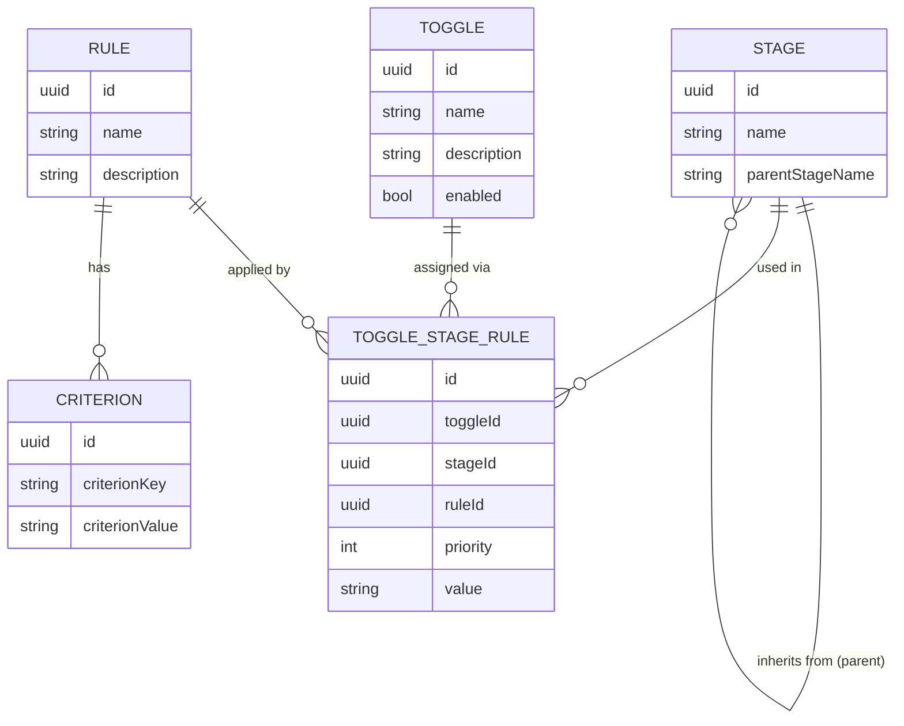
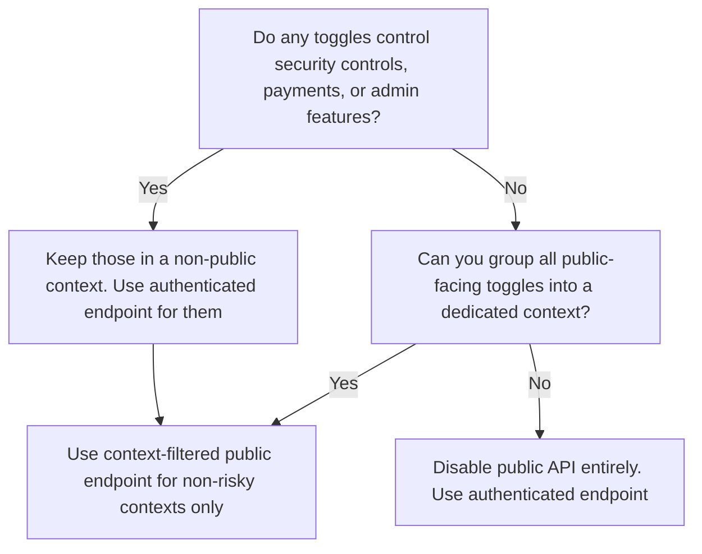

# User Manual

## Using abstoggle

### Overview

Abstoggle is a feature toggle service — a tool that lets teams enable or disable application features at runtime, without redeploying code. It lets you control which features are active for different environments and user groups by evaluating configurable rules against client context.

#### Key Features

- **OAuth Authentication** — Secure login via OAuth2/OpenID Connect providers. User sessions are managed with encrypted cookies and CSRF protection.
- **Auditing** — All administrative changes (create, update, delete operations on toggles, stages, and rules) are tracked with timestamps and user attribution for accountability and compliance.
- **In-Memory Caching** — Toggle query results are cached using Google Guava with configurable TTL and size limits to reduce database load and improve response times.
- **Stage Inheritance** — Stages can inherit configuration from parent stages. A toggle defined only for `prod` is automatically available to child stages like `test` and `dev`.
- **Built-in Tester** — Interactive testing page lets you simulate toggle evaluation with custom client context without writing any code.
- **Dark Mode** — Full dark mode support in the web UI for comfortable administration in low-light environments.
- **Low Footprint Native Image** — Built as a GraalVM native image for optimal performance, using as little as 64MB RAM and idling at near zero CPU.

#### Core concepts

- **Toggle** — a named feature flag (e.g. `new-checkout-flow`). A toggle has a description and can be enabled or disabled globally.
- **Stage** — an environment (e.g. `dev`, `test`, `prod`). Stages can inherit from a parent stage, so a toggle configured only for `prod` is automatically available to any stage that inherits from it.
- **Toggle Stage** — a toggle is activated for a stage by assigning it. Only assigned toggle-stage combinations are returned by the public query endpoint.
- **Rule** — a reusable criteria definition that can be assigned to any toggle+stage combination. Each rule has:
  - **Name** — a unique, human-readable identifier (e.g. `beta-testers`, `eu-premium`).
  - **Description** — what this rule targets.
  - **Criteria** — an ordered list of `{key, pattern}` pairs. The key names a client context attribute; the pattern is tested against the client's value for that attribute. If all criteria match, the rule matches. A rule with no criteria is a catch-all and always matches. The same key may appear more than once — all occurrences must match.
- **Toggle Stage Rule Assignment** — links a rule to a toggle within a stage and controls evaluation. Each assignment has:
  - **Priority** (integer, lower = higher priority) — assignments are evaluated in ascending priority order; the first match wins.
  - **Value** — the string to return when the assigned rule matches (e.g. `on`, `off`, or any custom string like `variant-b`).



#### Typical workflow

1. Create one or more **Stages** (e.g. `prod`, `test`, `dev` with `test` inheriting from `prod`).
2. Create reusable **Rules** with criteria (e.g. `beta-testers` with `userId = ^(alice|bob)$`, or `default-off` with no criteria as a catch-all).
3. Create a **Toggle** (e.g. `new-checkout-flow`).
4. Open the toggle and create **Assignments** — link each stage+rule combination, set the priority and the value to return when the rule matches (e.g. `on`, `off`, `variant-b`).
5. Your application calls the public endpoint, evaluates the assignments client-side, and gates behaviour on the resolved value.

---

### Toggle Evaluation

#### Public endpoint

Your application fetches toggle configuration from the unauthenticated endpoint:

```
GET /public/toggles?stage=<stageName>&context=<contextName>[&nameFilter=<toggleName>][&includeDisabled=true]
```

| Parameter | Required | Description |
|---|---|---|
| `stage` | Yes | The stage name your application is running in |
| `context` | Yes | Only toggles whose context matches this value are returned |
| `nameFilter` | No | Return only the named toggle (exact match) |
| `includeDisabled` | No | Include disabled toggles (default: `false`) |

Example response:

```json
{
  "toggles": [
    {
      "toggleName": "new-checkout-flow",
      "toggleDescription": "Enables the redesigned checkout",
      "toggleEnabled": true,
      "stageName": "prod",
      "ruleName": "eu-premium-users",
      "priority": 1,
      "value": "on",
      "ruleCriteria": [
        { "criterionKey": "country", "criterionValue": "/^(DE|AT|CH)$/i" },
        { "criterionKey": "plan",    "criterionValue": "premium" }
      ]
    },
    {
      "toggleName": "new-checkout-flow",
      "toggleDescription": "Enables the redesigned checkout",
      "toggleEnabled": true,
      "stageName": "prod",
      "ruleName": "default-off",
      "priority": 99,
      "value": "off",
      "ruleCriteria": []
    }
  ],
  "queryMetadata": {
    "stage": "prod",
    "nameFilter": null,
    "count": 2,
    "cacheHit": false
  }
}
```

The response is a **flat list** — each entry is one toggle+stage+rule assignment row. A single toggle with multiple assignments appears as multiple rows sorted by priority. The `stageName` field indicates which stage actually provided the configuration — it may be a parent stage if the requested stage inherits configuration from it.

#### Pattern matching

Criteria values are matched using regular expressions. Two formats are supported:

- **Literal regex string**: `de` — matches if the value contains `de`
- **Slash-delimited with flags**: `/^DE$/i` — standard JS literal notation; `i` makes it case-insensitive

If the pattern is not a valid regex, exact string equality is used as a fallback.

#### Client context

The client context is a flat map of string key-value pairs that your code assembles at runtime. Common attributes include:

```json
{
  "userId": "10042",
  "country": "DE",
  "plan": "premium",
  "userAgent": "Mozilla/5.0 (Macintosh; ...)",
  "region": "eu-west-1",
  "betaUser": "true"
}
```

The keys must match the criterion keys configured in the rules. Any key not present in the context is treated as an empty string when evaluated.

#### Algorithm

Rules are sorted by priority (ascending). For each rule, all criteria are tested against the client context. If all criteria match, that rule's value is returned immediately. If no rule matches, `"off"` is returned.

#### AND vs OR Logic

Rules support two kinds of logical composition:

| Logic | How to configure | Behaviour |
|-------|------------------|-----------|
| **AND** | Put multiple key/value pairs in **one rule's criteria** | Every criterion must match for the rule to fire. |
| **OR** | Create **multiple rules** and assign them to the same toggle+stage | Rules are evaluated in priority order; the first matching rule wins. Each rule is independent. |

**AND example** — DACH premium users only:

| criterionKey | criterionValue |
|---|---|
| `country` | `/^(DE|AT|CH)$/i` |
| `plan` | `premium` |

Both `country` AND `plan` must match (all criteria in one rule = AND logic).

**OR example** — DACH users OR users aged 50+:

Create two reusable rules and assign them to the same toggle+stage with different values and priorities:

| Priority | Rule | Value | Criteria |
|----------|------|-------|----------|
| 1 | `dach-users` | `on` | `country` = `/^(DE|AT|CH)$/i` |
| 2 | `age-50-plus` | `on` | `age` = `/^[5-9][0-9]$/` |
| 99 | `default-off` | `off` | *(none — catch-all)* |

A user from the DACH gets `on` via priority 1. A 55-year-old from the US gets `on` via priority 2. Everyone else falls through to the catch-all at priority 99.

> **Note:** You can put the same criterion key more than once in a rule — all occurrences must match independently. For OR on a single key you can also use a regular expression with alternation (e.g., `^(alice|bob)$`), or create a second rule.

#### Caching Considerations

The backend caches toggle query results using an in-memory cache with a configurable TTL (default: 60 seconds). The `cacheHit` flag in the response metadata indicates whether the result was served from the cache. The metadata also includes the TTL value.

While you could add caching to your client code, it generally makes little sense to cache the *evaluated results* — the same toggle can resolve to different values for different users based on their context. Caching evaluated results per user would require complex invalidation logic and could lead to stale feature states.

However, caching the *server response* (the raw toggle configuration) can be beneficial:
- Cache the `/public/toggles` response for short periods (e.g., 10-30 seconds) to reduce server load
- Use the `cacheHit` flag to monitor cache effectiveness
- Consider that the backend cache TTL is configurable via `toggle.cache.ttl-seconds`
- When you do fetch fresh data, perform the rule evaluation fresh each time — don't cache the evaluated result per user

#### Example Client Implementation

**JavaScript / TypeScript**

The response is a flat list of assignment rows. Filter by `toggleName`, sort by `priority`, then evaluate each row's `ruleCriteria` list in order:

```javascript
function matchesPattern(value, pattern) {
  try {
    const m = /^\/(.+)\/([gimsuy]*)$/.exec(pattern);
    return m ? new RegExp(m[1], m[2]).test(value)
             : new RegExp(pattern).test(value);
  } catch {
    return value === pattern;
  }
}

function evaluate(rows, toggleName, clientContext) {
  // rows is the flat toggles array from the response
  const relevant = rows
    .filter(r => r.toggleName === toggleName)
    .sort((a, b) => a.priority - b.priority);

  if (relevant.length === 0) return 'off';
  if (!relevant[0].toggleEnabled) return 'off';

  for (const row of relevant) {
    const criteria = row.ruleCriteria ?? [];
    const matches = criteria.length === 0 ||
      criteria.every(c =>
        matchesPattern(clientContext[c.criterionKey] ?? '', c.criterionValue));

    if (matches) return row.value ?? 'off';
  }
  return 'off';
}

// Usage
const response = await fetch('/public/toggles?stage=prod&context=frontend');
const { toggles } = await response.json();
const context = { userId: '10042', country: 'DE', plan: 'premium' };
const value = evaluate(toggles, 'new-checkout-flow', context);
if (value === 'on') { /* feature active */ }
```

**Java**

The response is a flat list. Group by `toggleName`, sort by `priority`, evaluate `ruleCriteria` as a list of `{criterionKey, criterionValue}` pairs:

```java
import java.util.*;
import java.util.regex.*;
import java.util.stream.*;

public class ToggleEvaluator {

    /** Each row is one QueryTSRDto: toggleName, toggleEnabled, priority, value, ruleCriteria */
    public static String evaluate(List<Map<String, Object>> rows, String toggleName,
                                  Map<String, String> clientContext) {
        List<Map<String, Object>> relevant = rows.stream()
            .filter(r -> toggleName.equals(r.get("toggleName")))
            .sorted(Comparator.comparingInt(r -> (int) r.get("priority")))
            .collect(Collectors.toList());

        if (relevant.isEmpty()) return "off";
        if (!Boolean.TRUE.equals(relevant.get(0).get("toggleEnabled"))) return "off";

        for (Map<String, Object> row : relevant) {
            @SuppressWarnings("unchecked")
            List<Map<String, String>> criteria =
                (List<Map<String, String>>) row.getOrDefault("ruleCriteria", List.of());
            if (matchesAll(criteria, clientContext)) {
                return String.valueOf(row.getOrDefault("value", "off"));
            }
        }
        return "off";
    }

    private static boolean matchesAll(List<Map<String, String>> criteria,
                                      Map<String, String> ctx) {
        return criteria.stream().allMatch(c ->
            matchesPattern(
                ctx.getOrDefault(c.get("criterionKey"), ""),
                c.get("criterionValue")));
    }

    private static boolean matchesPattern(String value, String pattern) {
        try {
            if (pattern.startsWith("/")) {
                int last = pattern.lastIndexOf('/');
                if (last > 0) {
                    String regex = pattern.substring(1, last);
                    String flags = pattern.substring(last + 1);
                    int f = flags.contains("i") ? Pattern.CASE_INSENSITIVE : 0;
                    return Pattern.compile(regex, f).matcher(value).find();
                }
            }
            return Pattern.compile(pattern).matcher(value).find();
        } catch (PatternSyntaxException e) {
            return value.equals(pattern);
        }
    }
}
```

**Python**

```python
import re
import requests

def matches_pattern(value: str, pattern: str) -> bool:
    try:
        if pattern.startswith('/'):
            last = pattern.rfind('/')
            if last > 0:
                regex = pattern[1:last]
                flags_str = pattern[last+1:]
                flags = re.IGNORECASE if 'i' in flags_str else 0
                return bool(re.search(regex, value, flags))
        return bool(re.search(pattern, value))
    except re.error:
        return value == pattern

def evaluate(rows: list, toggle_name: str, client_context: dict) -> str:
    """rows is the flat toggles list from the response; each row is a QueryTSRDto dict."""
    relevant = sorted(
        [r for r in rows if r.get('toggleName') == toggle_name],
        key=lambda r: r['priority']
    )
    if not relevant:
        return 'off'
    if not relevant[0].get('toggleEnabled', False):
        return 'off'
    for row in relevant:
        criteria = row.get('ruleCriteria', [])  # list of {criterionKey, criterionValue}
        if all(matches_pattern(client_context.get(c['criterionKey'], ''), c['criterionValue'])
               for c in criteria):
            return row.get('value', 'off')
    return 'off'

# Usage
response = requests.get('https://your-host/public/toggles',
                        params={'stage': 'prod', 'context': 'frontend'})
rows = response.json()['toggles']
context = {'userId': '10042', 'country': 'DE', 'plan': 'premium'}
value = evaluate(rows, 'new-checkout-flow', context)
if value == 'on':
    pass  # feature active
```

**Go**

```go
import (
    "regexp"
    "sort"
    "strings"
)

type Criterion struct {
    CriterionKey   string `json:"criterionKey"`
    CriterionValue string `json:"criterionValue"`
}

// Row is one QueryTSRDto entry from the flat toggles list
type Row struct {
    ToggleName        string      `json:"toggleName"`
    ToggleEnabled     bool        `json:"toggleEnabled"`
    Priority          int         `json:"priority"`
    Value             string      `json:"value"`
    RuleCriteria      []Criterion `json:"ruleCriteria"`
}

func matchesPattern(value, pattern string) bool {
    if strings.HasPrefix(pattern, "/") {
        last := strings.LastIndex(pattern, "/")
        if last > 0 {
            regex := pattern[1:last]
            flags := pattern[last+1:]
            if strings.Contains(flags, "i") {
                regex = "(?i)" + regex
            }
            if re, err := regexp.Compile(regex); err == nil {
                return re.MatchString(value)
            }
        }
    }
    if re, err := regexp.Compile(pattern); err == nil {
        return re.MatchString(value)
    }
    return value == pattern
}

func Evaluate(rows []Row, toggleName string, clientContext map[string]string) string {
    var relevant []Row
    for _, r := range rows {
        if r.ToggleName == toggleName {
            relevant = append(relevant, r)
        }
    }
    if len(relevant) == 0 {
        return "off"
    }
    sort.Slice(relevant, func(i, j int) bool { return relevant[i].Priority < relevant[j].Priority })
    if !relevant[0].ToggleEnabled {
        return "off"
    }

    for _, row := range relevant {
        matched := true
        for _, c := range row.RuleCriteria {
            v := clientContext[c.CriterionKey]
            if !matchesPattern(v, c.CriterionValue) {
                matched = false
                break
            }
        }
        if matched {
            return row.Value
        }
    }
    return "off"
}
```

---

### Public API Security Considerations

The `/public/toggles` endpoint is unauthenticated and **enabled by default**. Every response exposes toggle names, rule priorities, values, descriptions, and all criteria patterns. An attacker can use this to enumerate features under development, reverse-engineer targeting logic, forge context attributes to unlock features client-side, or identify which security controls exist.

**Toggles that are dangerous to expose publicly:**

| Toggle name | Risk |
|---|---|
| `fraud-detection-enabled` | Reveals whether fraud checking is active |
| `rate-limiting-bypass` | Discloses that a bypass exists and its criteria |
| `admin-panel-visible` | Tells attackers what attributes unlock the admin panel |
| `payment-provider-failover` | Exposes fallback payment routing logic |
| `kyc-check-required` | Discloses when identity verification is skipped |
| `new-auth-flow` | Signals an alternative auth path with potentially different security properties |

#### Strategy 1 — Use the context field to limit exposure

Every toggle has a **context** field (set in the create/edit form). The public API requires `context` as a mandatory parameter and returns **only toggles whose context matches**. This means you can:

- Place low-risk, UI-facing toggles in a context like `frontend` or `ui` and expose only those via the public endpoint.
- Keep sensitive toggles (payments, fraud, admin) in a different context such as `internal` — they are never returned by a public query.

```
GET /public/toggles?stage=prod&context=frontend
```

With well-chosen contexts, the public API is safe to call from a browser because the response is structurally limited to the toggles you explicitly put in that context bucket. **Always use `nameFilter` too** when you only need specific toggles:

```
GET /public/toggles?stage=prod&context=frontend&nameFilter=new-checkout-flow
```

#### Strategy 2 — Use the authenticated query endpoint

For sensitive toggles, call the authenticated endpoint from your backend instead. Your backend assembles the client context from trusted sources (session, JWT claims), evaluates the toggles, and returns only the resolved `on`/`off` values to the frontend — the rule logic is never exposed.

```
GET /api/query/toggles?stage=prod&context=internal
Authorization: Bearer <token>
```

This endpoint accepts tokens whose `groups` claim includes `abstratium-abstoggle_query` or `abstratium-abstoggle_user`. To obtain a token from your backend service:

```bash
curl -s -X POST https://your-auth-server/token \
  -d "grant_type=client_credentials" \
  -d "client_id=my-app-backend" \
  -d "client_secret=YOUR_SECRET" \
  -d "scope=openid"
```

Cache the token until its `expires_in` elapses to avoid a round-trip on every fetch.

#### Strategy 3 — Disable the public endpoint entirely

Set `PUBLIC_API_ENABLED=false` to make `/public/toggles` return `404`. All queries must then go through `/api/query/toggles` with a valid token. Use this when you cannot guarantee that your context grouping is sufficient.

#### Decision guide



> **Rule of thumb:** assign a `context` to every toggle from day one. Toggles in `frontend` are safe to query publicly. Toggles in `internal`, `payments`, or `security` should only be queried server-side via the authenticated endpoint.

---

### Testing

The built-in **Tester** page (accessible via the navigation bar) lets you simulate the evaluation without writing any code.

1. Navigate to **Tester** in the top navigation bar.
2. Select a **Stage** from the dropdown. The dropdown is populated from the stages configured in the system.
3. Optionally enter a **Toggle Name Filter** to restrict results to a single toggle.
4. Edit the **Client Context** table — add, remove, or change key-value pairs to represent the attributes of the client you want to simulate. The table is pre-populated with a sample context.
5. Click **Run Query**. The results table shows each toggle and its resolved value for the given context.
6. Click **▶ Log** on any row to expand a step-by-step evaluation trace showing which rules were tested, which criteria matched or failed, and how the final value was reached.
7. Click **⚙️ Configure** on any row to navigate directly to the toggle's configuration, where you can add or edit rules.

#### Tips

- Use `/pattern/i` syntax in criteria values for case-insensitive matching (e.g. `/^DE$/i` matches `DE`, `de`, `De`).
- A rule with **no criteria** is a catch-all — it always matches. Place it at the lowest priority (highest number) to act as a default.
- Rules are evaluated in **ascending priority order** — priority `1` is checked before priority `10`. The first matching rule wins.
- **AND logic**: all criteria within a single rule must match. **OR logic**: create multiple rules with different criteria — each is evaluated independently and the first match wins.
- If a toggle is configured on a **parent stage** only, it will still appear when querying a child stage — the `stageName` field in the response row shows which stage actually provided the configuration.
- The **cacheHit** flag in the response metadata indicates whether the result was served from cache. The cache TTL is configurable via the `toggle.cache.ttl-seconds` property.

---

### Practical Toggle Recipes

This section shows how to configure rules for common real-world scenarios.

#### 1. Groups of test users

Create two reusable rules with criteria, then assign them to toggle `new-feature-x` for stage `test` with different values and priorities.

**Rule: `new-features-testers`** — criterion: `userId` = `^(alice|bob|charlie)$`  
**Rule: `no-new-features-testers`** — no criteria (catch-all)

Assignment table for toggle `new-feature-x`, stage `test`:

| Priority | Rule | Value | Criteria |
|----------|------|-------|----------|
| 1 | `new-features-testers` | `on` | `userId` = `^(alice|bob|charlie)$` |
| 99 | `no-new-features-testers` | `off` | *(none — catch-all)* |

Alice, Bob, and Charlie get `on`; everyone else falls through to the catch-all and gets `off`.

#### 2. Percentage-based A/B testing via username

You can target a percentage of users by matching on a deterministic substring of their username.

**~25% of users — first letter A–F**  
Create a reusable rule with criterion `username` = `^[a-fA-F]`, then assign it to a toggle+stage with value `variant-b`.

**~50% of users — first letter A–M**  
Create a reusable rule with criterion `username` = `^[a-mA-M]`, then assign it with value `variant-b`.

**~10% of users — last digit of userId 0**  
Create a reusable rule with criterion `userId` = `0$`, then assign it with value `variant-b`.

**~10% of users — last two digits of userId 00–09**  
Create a reusable rule with criterion `userId` = `(00|01|02|03|04|05|06|07|08|09)$`, then assign it with value `variant-b`.

> **Tip:** The match is against the string value supplied in the client context, so `userId` must be sent as a string (e.g. `"10042"`) even if it is a number in your database.

Example assignment for a 50/50 split on toggle `new-feature`, stage `prod`:

| Priority | Rule | Value | Criteria |
|----------|------|-------|----------|
| 1 | `variant-b-users` | `variant-b` | `username` = `^[a-mA-M]` |
| 2 | `variant-a-users` | `variant-a` | *(none — catch-all)* |

#### 3. Country + plan targeting

Enable a feature only for premium users in the EU.

**Rule: `eu-premium`** — criteria (both must match — AND logic):

| criterionKey | criterionValue |
|---|---|
| `country` | `/^(DE|AT|CH|NL|BE|LU)$/i` |
| `plan` | `premium` |

**Rule: `default-off`** — no criteria (catch-all)

Assignment for toggle `eu-premium-feature`, stage `prod`:

| Priority | Rule | Value |
|----------|------|-------|
| 1 | `eu-premium` | `on` |
| 99 | `default-off` | `off` |

Both criteria within the `eu-premium` rule must match (AND logic) because they are in the same rule.

#### 4. Canary rollout by user ID hash prefix

If your client context includes a `userIdHash` field (e.g. the first 4 hex characters of a SHA-256 hash), you can release to a tiny fraction of users.

Create a reusable rule with criteria, then assign it with the desired value:

**~6% of users** — first hex digit `0` or `1`:  
Rule criterion: `userIdHash` = `^[01]`, assign with value `canary`.

**~0.4% of users** — first two hex digits `00`–`0f`:  
Rule criterion: `userIdHash` = `^0[0-9a-fA-F]`, assign with value `canary`.

#### 5. Time-based or date-based targeting

If your client context includes a `currentDate` or `currentHour` field, you can enable a feature only during specific windows.

Create a reusable rule with time-based criteria, then assign it with value `on`:

**Business hours only** (08:00–17:59):  
Rule criterion: `currentHour` = `^(08|09|1[0-7])$`, assign with value `on`.

**Weekdays only** (Mon–Fri, ISO day of week 1–5):  
Rule criterion: `dayOfWeek` = `^[1-5]$`, assign with value `on`.

#### 6. Device or browser targeting

Enable a feature only for mobile users.

Create reusable rules with device-based criteria, then assign them with the desired value:

**Mobile browsers only**:  
Rule criterion: `userAgent` = `/Mobile|Android|iPhone/i`, assign with value `on`.

**Chrome only**:  
Rule criterion: `userAgent` = `/Chrome/i`, assign with value `on`.

> **Note:** Always place the most specific assignment at the lowest priority number (highest priority) and the catch-all default at the end. The first matching assignment wins.

---

### Installation

It is intended that this component be run using docker.
It supports MySql and will soon also support postgresql and MS SQL Server.

You need to add a database/schema and a user to the database manually.

### Prerequisites

Before installation, ensure you have:

- **Docker** installed and running
- **MySQL 8.0+** database server
- **Network connectivity** between Docker container and MySQL
- **OpenSSL** for generating JWT keys
- **GitHub account** (if pulling from GitHub Container Registry)
- **nginx** or similar for reverse proxying and terminating TLS

### Create the Database, User and Grant Permissions

#### MySQL

This component requires a MySQL database. Create a database and user with the following steps:

1. **Connect to MySQL** as root or admin user:

(change `<password>` to your password)
```bash
docker run -it --rm --network abstratium mysql mysql -h abstratium-mysql --port 3306 -u root -p<password>

DROP USER IF EXISTS 'abstoggle'@'%';

CREATE USER 'abstoggle'@'%' IDENTIFIED BY '<password>';

DROP DATABASE IF EXISTS abstoggle;

CREATE DATABASE abstoggle CHARACTER SET utf8mb4 COLLATE utf8mb4_unicode_ci;
GRANT ALL PRIVILEGES ON abstoggle.* TO abstoggle@'%'; -- on own database

FLUSH PRIVILEGES;

EXIT;
```

This project will automatically create all necessary tables and any initial data when it first connects to the database.

New versions will update the database as needed.

### Pull and Run the Docker Container

1. **Pull the latest image** from GitHub Container Registry:
   ```bash
   docker pull ghcr.io/abstratium-dev/abstoggle:latest
   ```

2. **Run the container**:

_Replace all placeholder values with the values generated above.

   ```bash
   docker run -d \
     --name abstoggle \
     --network your-network \
     -p 127.0.0.1:41087:8087 \
     -p 127.0.0.1:9009:9009 \
     -e QUARKUS_DATASOURCE_JDBC_URL="jdbc:mysql://your-mysql-host:3306/abstoggle" \
     -e QUARKUS_DATASOURCE_USERNAME="abstoggle" \
     -e QUARKUS_DATASOURCE_PASSWORD="YOUR_SECURE_PASSWORD" \
     -e COOKIE_ENCRYPTION_SECRET="YOUR_COOKIE_ENCRYPTION_SECRET" \
     ghcr.io/abstratium-dev/abstoggle:latest
   ```

   **Required Environment Variables:**
   - `QUARKUS_DATASOURCE_JDBC_URL`: Database connection URL (format: `jdbc:mysql://<host>:<port>/<database>`)
   - `QUARKUS_DATASOURCE_USERNAME`: Database username
   - `QUARKUS_DATASOURCE_PASSWORD`: Database password (use strong, unique password)
   - `COOKIE_ENCRYPTION_SECRET`: Cookie encryption secret (min 32 chars, generate with `openssl rand -base64 32`)
   - `CSRF_TOKEN_SIGNATURE_KEY`: CSRF token signature key (min 32 chars, generate with `openssl rand -base64 64 | tr -d '\n'`)
   - `ABSTRATIUM_CLIENT_SECRET`: OIDC client secret for OAuth authentication (must be set)

   **Optional Environment Variables:**
   - `ABSTRA_WARNING_MESSAGE`: Warning banner message displayed at the top of the UI (e.g., "You are in the TEST environment!"). Set to "-" or leave empty to hide the banner.
   - `STAGE`: Deployment stage identifier exposed to the frontend (e.g., "dev", "test", "prod", defaults to "dev")
   - `ABSTRATIUM_CLIENT_ID`: OIDC client ID for OAuth authentication (defaults to `abstratium-abstoggle`)
   - `OTEL_EXPORTER_OTLP_ENDPOINT`: OpenTelemetry OTLP endpoint for traces and logs (e.g., `http://localhost:4317`, only used in production profile)
   - `DEPLOYMENT_ENV`: Deployment environment label for telemetry resource attributes (defaults to `dev`)
   - `PUBLIC_API_ENABLED`: Enable or disable the unauthenticated `/public/toggles` endpoint (defaults to `true`). Set to `false` to require all toggle queries to use the authenticated `/api/query/toggles` endpoint instead — see [Public API Security Considerations](#public-api-security-considerations).
   - `TOGGLE_CACHE_ENABLED`: Enable/disable caching for public toggle queries (defaults to `true`)
   - `TOGGLE_CACHE_TTL_SECONDS`: Cache TTL in seconds for toggle query results (defaults to `60`)
   - `TOGGLE_CACHE_MAX_SIZE_MB`: Maximum cache size in MB (defaults to `5`)
   

3. **Verify the container is running**:
   ```bash
   docker ps
   docker logs abstoggle
   curl http://localhost:41087/m/health
   curl http://localhost:41087/m/info
   ```

4. **Access the application**:
   - Main application: http://localhost:41087
   - Management interface: http://localhost:9009/m/info

## Monitoring and Health Checks

This project provides several endpoints for monitoring:

- **Health Check**: `http://localhost:9009/m/health`
  - Returns application health status
  - Includes database connectivity check

- **Info Endpoint**: `http://localhost:9009/m/info`
  - Returns build information, version, and configuration
  - Useful for verifying deployment

## Troubleshooting

### Container won't start

1. Check Docker logs: `docker logs abstoggle`
2. Verify environment variables are set correctly
3. Ensure database is accessible from container
4. Check network connectivity: `docker network inspect your-network`

### Database connection errors

1. Verify MySQL is running: `mysql -u abstoggle -p -h your-mysql-host`
2. Check firewall rules allow connection on port 3306
3. Verify database user has correct permissions
4. Check JDBC URL format is correct

### JWT token errors

1. Verify keys are correctly base64-encoded
2. Ensure public key matches private key
3. Check key length is at least 2048 bits
4. Verify no extra whitespace in environment variables

## Security Best Practices

1. **Never use default/test keys in production**
2. **Store secrets in secure secret management systems** (e.g., HashiCorp Vault, AWS Secrets Manager)
3. **Use strong, unique passwords** for database and admin accounts
4. **Enable HTTPS** in production (configure reverse proxy)
5. **Regularly update** the Docker image to get security patches
6. **Monitor logs** for suspicious activity
7. **Backup database regularly**
8. **Limit network access** to database and management interface
9. **Rotate JWT keys periodically** (requires user re-authentication)


