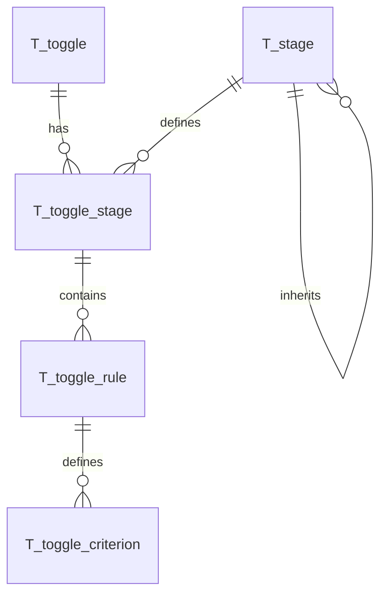

# Database Model Documentation

## Overview

This document describes the database model for abstoggle, a feature toggle service.

The schema is compatible with both MySQL and H2 databases and follows a naming convention where all tables are prefixed with `T_`, foreign keys with `FK_`, and indices with `I_`.

## Entity Relationship Diagram



## Table Descriptions

### T_toggle

The `T_toggle` table stores the master toggle definitions. Each toggle represents a feature flag that can have different values based on stages and matching criteria.

**Important:** Toggle names must be unique and follow the kebab-case naming convention (e.g., `new-payment-flow`).

#### Columns

| Column | Type | Nullable | Default | Description |
|--------|------|----------|---------|-------------|
| `id` | VARCHAR(36) | NO | - | Primary key (UUID v4) |
| `name` | VARCHAR(255) | NO | - | Unique toggle identifier (kebab-case) |
| `description` | TEXT | YES | NULL | Human-readable description |
| `created_by` | VARCHAR(255) | NO | - | User who created the toggle (JWT subject) |
| `created_at` | TIMESTAMP | NO | CURRENT_TIMESTAMP | Record creation time |
| `updated_at` | TIMESTAMP | NO | CURRENT_TIMESTAMP | Last modification time |
| `enabled` | BOOLEAN | NO | TRUE | Master switch to enable/disable toggle |

**Key Features:**
- UUID-based primary keys generated in Java code
- Soft delete via `enabled` flag (not physical deletion)
- Audit tracking via Hibernate Envers (`T_toggle_AUD` table)

**Constraints:**
- `UQ_toggle_name`: Unique constraint on name field

**Indices:**
- `I_toggle_name`: Index on name for quick lookups
- `I_toggle_enabled`: Index on enabled flag for filtering

**Relationships:**
- One-to-many with `T_toggle_stage` via `toggle_id`

**Security Features:**
- `created_by` field tracks who created the toggle
- Envers audit tracks all modifications

---

### T_toggle_stage

The `T_toggle_stage` table defines which stages (environments) a toggle is configured for. The actual toggle values are stored in `T_toggle_rule`, not here.

#### Columns

| Column | Type | Nullable | Default | Description |
|--------|------|----------|---------|-------------|
| `id` | VARCHAR(36) | NO | - | Primary key (UUID v4) |
| `toggle_id` | VARCHAR(36) | NO | - | FK to `T_toggle.id` (cascade delete) |
| `stage_id` | VARCHAR(36) | NO | - | FK to `T_stage.id` |
| `created_at` | TIMESTAMP | NO | CURRENT_TIMESTAMP | Record creation time |
| `updated_at` | TIMESTAMP | NO | CURRENT_TIMESTAMP | Last modification time |

**Key Features:**
- Links toggles to deployment stages via FK to `T_stage`
- Multiple stages per toggle supported
- Cascade delete removes stages when toggle is deleted
- Prevents orphaned stage references via FK constraint

**Constraints:**
- `UQ_toggle_stage_toggle_stage`: Unique constraint on (toggle_id, stage_id) - one toggle per stage
- `FK_toggle_stage_toggle_id`: Foreign key to `T_toggle`
- `FK_toggle_stage_stage_id`: Foreign key to `T_stage`

**Indices:**
- `I_toggle_stage_stage`: Index on stage_id for joins

**Relationships:**
- Many-to-one with `T_toggle` via `toggle_id`
- Many-to-one with `T_stage` via `stage_id`
- One-to-many with `T_toggle_rule` via `toggle_stage_id`

---

### T_toggle_rule

The `T_toggle_rule` table stores the actual toggle values and their evaluation priority. Each rule can have multiple criteria that must all match (AND logic). Multiple rules per stage provide OR logic.

#### Columns

| Column | Type | Nullable | Default | Description |
|--------|------|----------|---------|-------------|
| `id` | VARCHAR(36) | NO | - | Primary key (UUID v4) |
| `toggle_stage_id` | VARCHAR(36) | NO | - | FK to `T_toggle_stage.id` (cascade delete) |
| `rule_value` | VARCHAR(255) | NO | 'off' | Toggle value when criteria match |
| `description` | VARCHAR(500) | YES | NULL | Human-readable description of this rule |
| `priority` | INT | NO | 100 | Evaluation order (lower = first) |
| `created_at` | TIMESTAMP | NO | CURRENT_TIMESTAMP | Record creation time |
| `updated_at` | TIMESTAMP | NO | CURRENT_TIMESTAMP | Last modification time |

**Key Features:**
- Priority-based rule evaluation (lower = evaluated first)
- Each rule has a value ("off" or custom string) and description
- Empty criteria = catch-all rule that always matches
- Audit tracking via Hibernate Envers (`T_toggle_rule_AUD` table)

**Constraints:**
- `FK_toggle_rule_stage_id`: Foreign key to `T_toggle_stage`

**Indices:**
- `I_toggle_rule_stage_priority`: Composite index on (toggle_stage_id, priority) for efficient rule ordering

**Relationships:**
- Many-to-one with `T_toggle_stage` via `toggle_stage_id`
- One-to-many with `T_toggle_criterion` via `toggle_rule_id`

---

### T_toggle_criterion

The `T_toggle_criterion` table stores the individual criteria (key/value pairs) for each rule. Values support regex patterns for flexible matching.

#### Columns

| Column | Type | Nullable | Default | Description |
|--------|------|----------|---------|-------------|
| `id` | VARCHAR(36) | NO | - | Primary key (UUID v4) |
| `toggle_rule_id` | VARCHAR(36) | NO | - | FK to `T_toggle_rule.id` (cascade delete) |
| `criterion_key` | VARCHAR(100) | NO | - | Key for matching (e.g., "country", "age") |
| `criterion_value` | VARCHAR(500) | NO | - | Value or regex pattern to match |
| `created_at` | TIMESTAMP | NO | CURRENT_TIMESTAMP | Record creation time |

**Key Features:**
- Criteria within a rule use AND logic (all must match)
- Values can be exact strings or regex patterns (e.g., `/^[5-9][0-9]$/`)
- Audit tracking via Hibernate Envers (`T_toggle_criterion_AUD` table)

**Constraints:**
- `FK_toggle_criterion_rule_id`: Foreign key to `T_toggle_rule`

**Indices:**
- `I_toggle_criterion_key`: Index on criterion_key for potential optimization

**Relationships:**
- Many-to-one with `T_toggle_rule` via `toggle_rule_id`

**Example Criteria:**
- `{"country": "EU"}` - Exact match
- `{"age": "/^[5-9][0-9]$/"}` - Regex match (ages 50-99)
- `{"userId": "/admin-.*/"}` - Regex match (user IDs starting with "admin-")

---

### T_stage

The `T_stage` table stores the configurable stages (environments) that can be used across all toggles. This provides a controlled vocabulary for stage names with optional inheritance support.

#### Columns

| Column | Type | Nullable | Default | Description |
|--------|------|----------|---------|-------------|
| `id` | VARCHAR(36) | NO | - | Primary key (UUID v4) |
| `name` | VARCHAR(100) | NO | - | Unique stage identifier (e.g., "dev", "test", "prod") |
| `description` | VARCHAR(500) | YES | NULL | Human-readable description |
| `display_order` | INT | NO | 0 | UI presentation order (lower = first) |
| `parent_stage_id` | VARCHAR(36) | YES | NULL | Self-referencing FK for inheritance chain |
| `created_at` | TIMESTAMP | NO | CURRENT_TIMESTAMP | Record creation time |

**Key Features:**
- Predefined list of valid stage names (dev, test, prod, etc.)
- Display order for UI presentation
- Self-referencing FK for inheritance chains (e.g., `dev → test → prod`)
- Inheritance allows stage fallback behavior

**Constraints:**
- `UQ_stage_name`: Unique constraint on stage name
- `FK_stage_parent_stage_id`: Self-referencing FK for inheritance (nullable)

**Indices:**
- `I_stage_display_order`: Index for ordering stages in UI
- `I_stage_parent_stage`: Index on parent_stage_id for inheritance lookups

**Default Data:**
```sql
-- Inheritance chain: dev → test → prod
INSERT INTO T_stage (id, name, description, display_order, parent_stage_id) VALUES
    ('018fa3e4-0000-7000-8000-000000000001', 'prod', 'Production environment', 1, NULL),
    ('018fa3e4-0000-7000-8000-000000000002', 'test', 'Testing/QA environment', 2, '018fa3e4-0000-7000-8000-000000000001'),
    ('018fa3e4-0000-7000-8000-000000000003', 'dev', 'Development environment', 3, '018fa3e4-0000-7000-8000-000000000002');
```

**Important:** Deleting a stage from `T_stage` will fail if:
- Any toggles reference it via `T_toggle_stage`
- Any child stages reference it via `parent_stage_id`

(FK constraints prevent orphaned references and circular inheritance)

---

### Audit Tables (Envers)

Hibernate Envers automatically creates audit tables with `_AUD` suffix for all `@Audited` entities:

| Table | Audit Table | Description |
|-------|-------------|-------------|
| `T_toggle` | `T_toggle_AUD` | Tracks toggle metadata changes |
| `T_toggle_stage` | `T_toggle_stage_AUD` | Tracks stage additions/removals |
| `T_toggle_rule` | `T_toggle_rule_AUD` | Tracks rule changes (value, priority, description) |
| `T_toggle_criterion` | `T_toggle_criterion_AUD` | Tracks criteria changes |
| `T_stage` | `T_stage_AUD` | Tracks stage definition and inheritance changes |

**REVINFO Table:**
The `REVINFO` table stores revision metadata:
- `REV`: Revision number (primary key)
- `REVTSTMP`: Revision timestamp
- `username`: Custom field capturing who made the change

## SQL DDL Schema (Flyway Migration)

Complete database schema for reference:

```sql
-- Toggle master table
CREATE TABLE T_toggle (
    id VARCHAR(36) PRIMARY KEY,
    name VARCHAR(255) NOT NULL,
    description TEXT,
    created_by VARCHAR(255) NOT NULL,
    created_at TIMESTAMP DEFAULT CURRENT_TIMESTAMP,
    updated_at TIMESTAMP DEFAULT CURRENT_TIMESTAMP,
    enabled BOOLEAN DEFAULT TRUE,
    CONSTRAINT UQ_toggle_name UNIQUE (name)
);

CREATE INDEX I_toggle_name ON T_toggle(name);
CREATE INDEX I_toggle_enabled ON T_toggle(enabled);

-- Configurable stages with optional inheritance
CREATE TABLE T_stage (
    id VARCHAR(36) PRIMARY KEY,
    name VARCHAR(100) NOT NULL,
    description VARCHAR(500),
    display_order INT DEFAULT 0,
    parent_stage_id VARCHAR(36),
    created_at TIMESTAMP DEFAULT CURRENT_TIMESTAMP,
    CONSTRAINT UQ_stage_name UNIQUE (name),
    CONSTRAINT FK_stage_parent_stage_id FOREIGN KEY (parent_stage_id) REFERENCES T_stage(id)
);

CREATE INDEX I_stage_display_order ON T_stage(display_order);
CREATE INDEX I_stage_parent_stage ON T_stage(parent_stage_id);

-- Stage definitions per toggle
CREATE TABLE T_toggle_stage (
    id VARCHAR(36) PRIMARY KEY,
    toggle_id VARCHAR(36) NOT NULL,
    stage_id VARCHAR(36) NOT NULL,
    created_at TIMESTAMP DEFAULT CURRENT_TIMESTAMP,
    updated_at TIMESTAMP DEFAULT CURRENT_TIMESTAMP,
    CONSTRAINT FK_toggle_stage_toggle_id FOREIGN KEY (toggle_id) REFERENCES T_toggle(id) ON DELETE CASCADE,
    CONSTRAINT FK_toggle_stage_stage_id FOREIGN KEY (stage_id) REFERENCES T_stage(id),
    CONSTRAINT UQ_toggle_stage_toggle_stage UNIQUE (toggle_id, stage_id)
);

CREATE INDEX I_toggle_stage_stage ON T_toggle_stage(stage_id);

-- Rules per stage
CREATE TABLE T_toggle_rule (
    id VARCHAR(36) PRIMARY KEY,
    toggle_stage_id VARCHAR(36) NOT NULL,
    rule_value VARCHAR(255) DEFAULT 'off',
    description VARCHAR(500),
    priority INT DEFAULT 100,
    created_at TIMESTAMP DEFAULT CURRENT_TIMESTAMP,
    updated_at TIMESTAMP DEFAULT CURRENT_TIMESTAMP,
    CONSTRAINT FK_toggle_rule_stage_id FOREIGN KEY (toggle_stage_id) REFERENCES T_toggle_stage(id) ON DELETE CASCADE
);

CREATE INDEX I_toggle_rule_stage_priority ON T_toggle_rule(toggle_stage_id, priority);

-- Matching criteria per rule
CREATE TABLE T_toggle_criterion (
    id VARCHAR(36) PRIMARY KEY,
    toggle_rule_id VARCHAR(36) NOT NULL,
    criterion_key VARCHAR(100) NOT NULL,
    criterion_value VARCHAR(500) NOT NULL,
    created_at TIMESTAMP DEFAULT CURRENT_TIMESTAMP,
    CONSTRAINT FK_toggle_criterion_rule_id FOREIGN KEY (toggle_rule_id) REFERENCES T_toggle_rule(id) ON DELETE CASCADE
);

CREATE INDEX I_toggle_criterion_key ON T_toggle_criterion(criterion_key);

-- Seed default stages with inheritance chain: dev → test → prod
INSERT INTO T_stage (id, name, description, display_order, parent_stage_id) VALUES
    ('018fa3e4-0000-7000-8000-000000000001', 'prod', 'Production environment', 1, NULL),
    ('018fa3e4-0000-7000-8000-000000000002', 'test', 'Testing/QA environment', 2, '018fa3e4-0000-7000-8000-000000000001'),
    ('018fa3e4-0000-7000-8000-000000000003', 'dev', 'Development environment', 3, '018fa3e4-0000-7000-8000-000000000002');
```

## Naming Conventions

The database follows strict naming conventions for consistency and clarity:

- **Tables**: Prefixed with `T_` (e.g., `T_accounts`, `T_oauth_clients`)
- **Foreign Keys**: Format `FK_<tableName>_<columnName>` (e.g., `FK_credentials_account_id`)
- **Indices**: Format `I_<tableName>_<columnName(s)>` (e.g., `I_accounts_email`)
- **Primary Keys**: Always named `id` using VARCHAR(36) for UUID storage
- **Timestamps**: Use `created_at` and `expires_at` naming pattern

## Data Flow

### Toggle Query Flow

1. Client requests toggles for a specific stage with optional name filter
2. Service checks Guava cache first (key = stage + nameFilter + includeDisabled)
3. On cache miss: Query database for matching toggles
4. Load toggle with all its stages, rules (sorted by priority), and criteria
5. Build response with nested structure: toggle -> stage -> rules -> criteria
6. Store result in cache with configurable TTL
7. Client receives toggles and evaluates rules against local context

### Toggle Administration Flow

1. Admin creates toggle: Insert into `T_toggle`
2. Add stage: Insert into `T_toggle_stage`
3. Add rules: Insert into `T_toggle_rule` with priority and value
4. Add criteria: Insert into `T_toggle_criterion` for each rule
5. All operations automatically audited via Envers

### Data Modification Flow

1. Any INSERT/UPDATE/DELETE on audited entities triggers Envers
2. Envers inserts record into corresponding `_AUD` table
3. Envers updates or inserts into `REVINFO` table
4. Audit history available via `/api/admin/audits/*` endpoints

## Database Compatibility

The schema is designed to work with both MySQL and H2 databases:

- Uses standard SQL data types
- Avoids database-specific features
- Named constraints for explicit control
- Separate CREATE INDEX statements for compatibility
- BOOLEAN type supported by both databases
- VARCHAR lengths within common limits

## Indexes and Performance

Strategic indexes are placed for common query patterns:

- **Unique Indexes**: Enforce business rules (email, username, client_id, code)
- **Composite Indexes**: Support multi-column queries (client_id + account_id)
- **Expiration Indexes**: Enable efficient cleanup of expired records
- **Foreign Key Indexes**: Implicit indexes on FK columns for join performance

## Security Considerations

- **Audit Trail**: All changes tracked via Hibernate Envers with username attribution
- **Cascade Deletes**: Automatic cleanup of related records (rules deleted when stage deleted, stages deleted when toggle deleted)
- **No Sensitive Data**: Toggle values are strings (not passwords); criteria may contain patterns but not user data
- **Read-Only Audit Tables**: Envers audit tables should not be manually modified

## Maintenance

### Audit Table Cleanup

Audit tables grow indefinitely. Consider periodic archiving:

```sql
-- Archive old revisions (e.g., older than 1 year)
INSERT INTO T_toggle_AUD_archive 
SELECT * FROM T_toggle_AUD 
WHERE REV < (SELECT MIN(REV) FROM REVINFO WHERE REVTSTMP < UNIX_TIMESTAMP(DATE_SUB(NOW(), INTERVAL 1 YEAR)) * 1000);

-- Delete archived revisions
DELETE FROM T_toggle_AUD 
WHERE REV < (SELECT MIN(REV) FROM REVINFO WHERE REVTSTMP < UNIX_TIMESTAMP(DATE_SUB(NOW(), INTERVAL 1 YEAR)) * 1000);
```

### Monitoring Queries

```sql
-- Count active toggles per stage
SELECT ts.stage_name, COUNT(*) as toggle_count
FROM T_toggle t
JOIN T_toggle_stage ts ON t.id = ts.toggle_id
WHERE t.enabled = TRUE
GROUP BY ts.stage_name;

-- Find toggles with no rules (potential configuration issues)
SELECT t.name, ts.stage_name
FROM T_toggle t
JOIN T_toggle_stage ts ON t.id = ts.toggle_id
LEFT JOIN T_toggle_rule tr ON ts.id = tr.toggle_stage_id
WHERE tr.id IS NULL;

-- Recent audit activity
SELECT r.REV, r.REVTSTMP, r.username, COUNT(*) as changes
FROM REVINFO r
JOIN T_toggle_AUD ta ON r.REV = ta.REV
WHERE r.REVTSTMP > UNIX_TIMESTAMP(DATE_SUB(NOW(), INTERVAL 24 HOUR)) * 1000
GROUP BY r.REV, r.REVTSTMP, r.username
ORDER BY r.REV DESC;

-- Rules with high priority (evaluated first)
SELECT t.name, ts.stage_name, tr.priority, tr.rule_value, tr.description
FROM T_toggle_rule tr
JOIN T_toggle_stage ts ON tr.toggle_stage_id = ts.id
JOIN T_toggle t ON ts.toggle_id = t.id
WHERE tr.priority < 10
ORDER BY tr.priority;
```

