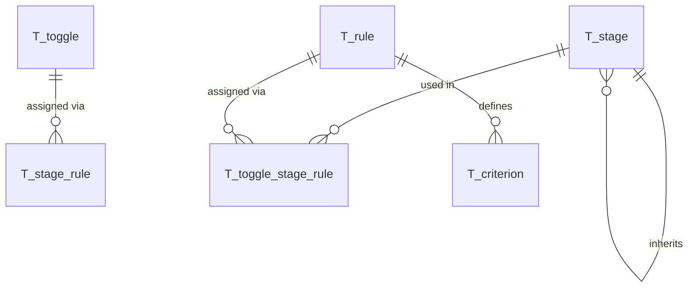

# Database Model Documentation

## Overview

This document describes the database model for abstoggle, a feature toggle service.

The schema is compatible with both MySQL and H2 databases and follows a naming convention where all tables are prefixed with `T_`, foreign keys with `FK_`, and indices with `I_`.

## Entity Relationship Diagram



## Table Descriptions

### T_toggle

The `T_toggle` table stores the master toggle definitions. Each toggle represents a feature flag that can have different values based on stages and matching criteria.

**Important:** Toggle names must be unique and follow the kebab-case naming convention (e.g., `new-payment-flow`).

#### Columns

| Column | Type | Nullable | Default | Description |
|--------|------|----------|---------|-------------|
| `id` | VARCHAR(36) | NO | - | Primary key (UUID v4) |
| `name` | VARCHAR(255) | NO | - | Unique toggle identifier (kebab-case) |
| `description` | TEXT | YES | NULL | Human-readable description |
| `enabled` | BOOLEAN | NO | TRUE | Master switch to enable/disable toggle |

**Key Features:**
- UUID-based primary keys generated in Java code
- Soft delete via `enabled` flag (not physical deletion)
- Audit tracking via Hibernate Envers (`T_toggle_AUD` table)

**Constraints:**
- `UQ_toggle_name`: Unique constraint on name field

**Indices:**
- `I_toggle_name`: Index on name for quick lookups
- `I_toggle_enabled`: Index on enabled flag for filtering

**Relationships:**
- One-to-many with `T_toggle_stage_rule` via `toggle_id`

**Audit Features:**
- Envers audit tracks all modifications

---

### T_rule

The `T_rule` table stores reusable rule definitions — each rule specifies a set of criteria under an optional description and a unique name. Rules are independent of any specific toggle or stage and can be shared across multiple toggle+stage combinations via `T_toggle_stage_rule`. The actual toggle value is set on the assignment (`T_toggle_stage_rule`), not on the rule itself.

Each rule can have multiple criteria that must all match (AND logic). Multiple rules assigned to the same toggle+stage combination provide OR logic, evaluated in priority order.

#### Columns

| Column | Type | Nullable | Default | Description |
|--------|------|----------|---------|-------------|
| `id` | VARCHAR(36) | NO | - | Primary key (UUID v4) |
| `name` | VARCHAR(255) | NO | - | Unique human-readable identifier for this rule |
| `description` | VARCHAR(500) | YES | NULL | Human-readable description of this rule's intent |

**Key Features:**
- Rules are standalone and reusable across any number of toggle-stage combinations
- Each rule defines a set of criteria and a unique name; the value is set per-assignment
- Empty criteria = catch-all rule that always matches
- Audit tracking via Hibernate Envers (`T_rule_AUD` table)

**Constraints:**
- `UQ_rule_name`: Unique constraint on name field

**Indices:**
- `I_rule_name`: Index on name for lookups

**Relationships:**
- One-to-many with `T_criterion` via `toggle_rule_id`
- Many-to-many with `T_toggle` and `T_stage` via `T_toggle_stage_rule`

---

### T_toggle_stage_rule

The `T_toggle_stage_rule` table directly links a toggle, a stage, and a rule in a single row. A toggle can only appear on a stage if at least one rule is assigned. The `priority` column controls evaluation order within a toggle+stage combination.

#### Columns

| Column | Type | Nullable | Default | Description |
|--------|------|----------|---------|-------------|
| `id` | VARCHAR(36) | NO | - | Primary key (UUID v4) |
| `toggle_id` | VARCHAR(36) | NO | - | FK to `T_toggle.id` (cascade delete) |
| `stage_id` | VARCHAR(36) | NO | - | FK to `T_stage.id` |
| `rule_id` | VARCHAR(36) | NO | - | FK to `T_rule.id` |
| `rule_value` | VARCHAR(255) | NO | 'off' | Toggle value returned when all criteria match |
| `priority` | INT | NO | 100 | Evaluation order within this toggle+stage (lower = first) |

**Key Features:**
- A toggle has no presence on a stage until at least one rule is assigned
- The same rule can be assigned to multiple toggle+stage combinations
- Priority is per-assignment, so the same rule can have different priorities in different contexts
- Cascade delete on `toggle_id` removes all assignments when a toggle is deleted; the rule definition itself is preserved
- Removing all assignments for a toggle+stage implicitly removes the toggle from that stage

**Constraints:**
- `UQ_toggle_stage_rule_toggle_stage_rule`: Unique constraint on (toggle_id, stage_id, rule_id) — a rule can only be assigned once per toggle+stage combination
- `FK_toggle_stage_rule_toggle_id`: Foreign key to `T_toggle`
- `FK_toggle_stage_rule_stage_id`: Foreign key to `T_stage`
- `FK_toggle_stage_rule_rule_id`: Foreign key to `T_rule`

**Indices:**
- `I_toggle_stage_rule_toggle_stage_priority`: Composite index on (toggle_id, stage_id, priority) for efficient rule ordering during evaluation
- `I_toggle_stage_rule_stage`: Index on stage_id for joins

**Relationships:**
- Many-to-one with `T_toggle` via `toggle_id`
- Many-to-one with `T_stage` via `stage_id`
- Many-to-one with `T_rule` via `rule_id`

---

### T_criterion

The `T_criterion` table stores the individual criteria (key/value pairs) for each rule. Values support regex patterns for flexible matching.

#### Columns

| Column | Type | Nullable | Default | Description |
|--------|------|----------|---------|-------------|
| `id` | VARCHAR(36) | NO | - | Primary key (UUID v4) |
| `toggle_rule_id` | VARCHAR(36) | NO | - | FK to `T_rule.id` (cascade delete) |
| `criterion_key` | VARCHAR(100) | NO | - | Key for matching (e.g., "country", "age") |
| `criterion_value` | VARCHAR(500) | NO | - | Value or regex pattern to match |

**Key Features:**
- Criteria within a rule use AND logic (all must match)
- Values can be exact strings or regex patterns (e.g., `/^[5-9][0-9]$/`)
- Audit tracking via Hibernate Envers (`T_criterion_AUD` table)

**Constraints:**
- `FK_criterion_rule_id`: Foreign key to `T_rule`

**Indices:**
- `I_criterion_key`: Index on criterion_key for potential optimization

**Relationships:**
- Many-to-one with `T_rule` via `rule_id`

**Example Criteria:**
- `{"country": "EU"}` - Exact match
- `{"age": "/^[5-9][0-9]$/"}` - Regex match (ages 50-99)
- `{"userId": "/admin-.*/"}` - Regex match (user IDs starting with "admin-")

---

### T_stage

The `T_stage` table stores the configurable stages (environments) that can be used across all toggles. This provides a controlled vocabulary for stage names with optional inheritance support.

#### Columns

| Column | Type | Nullable | Default | Description |
|--------|------|----------|---------|-------------|
| `id` | VARCHAR(36) | NO | - | Primary key (UUID v4) |
| `name` | VARCHAR(100) | NO | - | Unique stage identifier (e.g., "dev", "test", "prod") |
| `description` | VARCHAR(500) | YES | NULL | Human-readable description |
| `display_order` | INT | NO | 0 | UI presentation order (lower = first) |
| `parent_stage_id` | VARCHAR(36) | YES | NULL | Self-referencing FK for inheritance chain |

**Key Features:**
- Predefined list of valid stage names (dev, test, prod, etc.)
- Display order for UI presentation
- Self-referencing FK for inheritance chains (e.g., `dev → test → prod`)
- Inheritance allows stage fallback behavior

**Constraints:**
- `UQ_stage_name`: Unique constraint on stage name
- `FK_stage_parent_stage_id`: Self-referencing FK for inheritance (nullable)

**Indices:**
- `I_stage_display_order`: Index for ordering stages in UI
- `I_stage_parent_stage`: Index on parent_stage_id for inheritance lookups

**Default Data:**
```sql
-- Inheritance chain: dev → test → prod
INSERT INTO T_stage (id, name, description, display_order, parent_stage_id) VALUES
    ('018fa3e4-0000-7000-8000-000000000001', 'prod', 'Production environment', 1, NULL),
    ('018fa3e4-0000-7000-8000-000000000002', 'test', 'Testing/QA environment', 2, '018fa3e4-0000-7000-8000-000000000001'),
    ('018fa3e4-0000-7000-8000-000000000003', 'dev', 'Development environment', 3, '018fa3e4-0000-7000-8000-000000000002');
```

**Important:** Deleting a stage from `T_stage` will fail if:
- Any toggles reference it via `T_stage`
- Any child stages reference it via `parent_stage_id`

(FK constraints prevent orphaned references and circular inheritance)

---

### Audit Tables (Envers)

Hibernate Envers automatically creates audit tables with `_AUD` suffix for all `@Audited` entities:

| Table | Audit Table | Description |
|-------|-------------|-------------|
| `T_toggle` | `T_toggle_AUD` | Tracks toggle metadata changes |
| `T_rule` | `T_rule_AUD` | Tracks rule definition changes (name, description) |
| `T_toggle_stage_rule` | `T_toggle_stage_rule_AUD` | Tracks rule assignments (toggle+stage+rule+priority+value) |
| `T_criterion` | `T_criterion_AUD` | Tracks criteria changes |
| `T_stage` | `T_stage_AUD` | Tracks stage definition and inheritance changes |

**REVINFO Table:**
The `REVINFO` table stores revision metadata:
- `REV`: Revision number (primary key)
- `REVTSTMP`: Revision timestamp
- `username`: Custom field capturing who made the change

## Naming Conventions

The database follows strict naming conventions for consistency and clarity:

- **Tables**: Prefixed with `T_` (e.g., `T_accounts`, `T_oauth_clients`)
- **Foreign Keys**: Format `FK_<tableName>_<columnName>` (e.g., `FK_credentials_account_id`)
- **Indices**: Format `I_<tableName>_<columnName(s)>` (e.g., `I_accounts_email`)
- **Primary Keys**: Always named `id` using VARCHAR(36) for UUID storage

## Data Flow

### Toggle Query Flow

1. Client requests toggles for a specific stage with optional name filter
2. Service checks Guava cache first (key = stage + nameFilter + includeDisabled)
3. On cache miss: Query database for matching toggles
4. Load toggle with all its stages, assigned rules (ordered by priority via `T_toggle_stage_rule`), and criteria
5. Build response with nested structure: toggle -> stage -> rules -> criteria
6. Store result in cache with configurable TTL
7. Client receives toggles and evaluates rules against local context

### Toggle Administration Flow

1. Admin creates toggle: Insert into `T_toggle`
2. Create or pick an existing rule: Insert into `T_rule` (or reuse an existing rule id)
3. Add criteria to the rule: Insert into `T_criterion` (if newly created)
4. Assign rule to toggle+stage: Insert into `T_toggle_stage_rule` with desired `stage_id`, `priority`, and `rule_value`
5. All operations automatically audited via Envers

### Data Modification Flow

1. Any INSERT/UPDATE/DELETE on audited entities triggers Envers
2. Envers inserts record into corresponding `_AUD` table
3. Envers updates or inserts into `REVINFO` table
4. Audit history available via `/api/admin/audits/*` endpoints

## Database Compatibility

The schema is designed to work with both MySQL and H2 databases:

- Uses standard SQL data types
- Avoids database-specific features
- Named constraints for explicit control
- Separate CREATE INDEX statements for compatibility
- BOOLEAN type supported by both databases
- VARCHAR lengths within common limits

## Indexes and Performance

Strategic indexes are placed for common query patterns:

- **Unique Indexes**: Enforce business rules (email, username, client_id, code)
- **Composite Indexes**: Support multi-column queries (client_id + account_id)
- **Expiration Indexes**: Enable efficient cleanup of expired records
- **Foreign Key Indexes**: Implicit indexes on FK columns for join performance

## Security Considerations

- **Audit Trail**: All changes tracked via Hibernate Envers with username attribution
- **Cascade Deletes**: Deleting a `T_toggle` cascades to all its `T_toggle_stage_rule` assignments; rule definitions (`T_rule`) and their criteria are preserved for reuse unless explicitly deleted
- **No Sensitive Data**: Toggle values are strings (not passwords); criteria may contain patterns but not user data
- **Read-Only Audit Tables**: Envers audit tables should not be manually modified

## Maintenance

### Audit Table Cleanup

Audit tables grow indefinitely. Consider periodic archiving:

```sql
-- Archive old revisions (e.g., older than 1 year)
INSERT INTO T_toggle_AUD_archive 
SELECT * FROM T_toggle_AUD 
WHERE REV < (SELECT MIN(REV) FROM REVINFO WHERE REVTSTMP < UNIX_TIMESTAMP(DATE_SUB(NOW(), INTERVAL 1 YEAR)) * 1000);

-- Delete archived revisions
DELETE FROM T_toggle_AUD 
WHERE REV < (SELECT MIN(REV) FROM REVINFO WHERE REVTSTMP < UNIX_TIMESTAMP(DATE_SUB(NOW(), INTERVAL 1 YEAR)) * 1000);
```

### Monitoring Queries

```sql
-- Count active toggles per stage
SELECT s.name AS stage_name, COUNT(DISTINCT tsr.toggle_id) AS toggle_count
FROM T_toggle_stage_rule tsr
JOIN T_toggle t ON tsr.toggle_id = t.id
JOIN T_stage s ON tsr.stage_id = s.id
WHERE t.enabled = TRUE
GROUP BY s.name;

-- Recent audit activity
SELECT r.REV, r.REVTSTMP, r.username, COUNT(*) as changes
FROM REVINFO r
JOIN T_toggle_AUD ta ON r.REV = ta.REV
WHERE r.REVTSTMP > UNIX_TIMESTAMP(DATE_SUB(NOW(), INTERVAL 24 HOUR)) * 1000
GROUP BY r.REV, r.REVTSTMP, r.username
ORDER BY r.REV DESC;

-- Rules with high priority (evaluated first) across all toggle+stage contexts
SELECT t.name AS toggle_name, s.name AS stage_name, tsr.priority, tsr.rule_value, tr.name AS rule_name, tr.description
FROM T_toggle_stage_rule tsr
JOIN T_rule tr ON tsr.rule_id = tr.id
JOIN T_stage s ON tsr.stage_id = s.id
JOIN T_toggle t ON tsr.toggle_id = t.id
WHERE tsr.priority < 10
ORDER BY tsr.priority;

-- Rules shared across multiple toggle+stage contexts
SELECT tr.name AS rule_name, tsr.rule_value, COUNT(tsr.id) AS assignment_count
FROM T_rule tr
JOIN T_toggle_stage_rule tsr ON tr.id = tsr.rule_id
GROUP BY tr.id, tr.name, tsr.rule_value
HAVING COUNT(tsr.id) > 1
ORDER BY assignment_count DESC;
```

