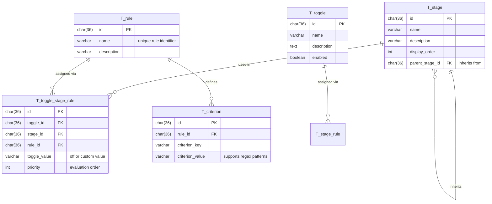
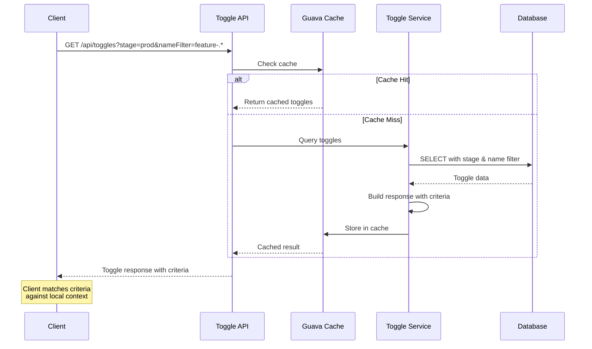

# Feature Toggle Service Design Document

## Overview

This document outlines the design for a feature toggle service that allows administrators to define toggles with stage-specific values and matching criteria. Clients query toggles and apply client-side matching against criteria dictionaries.

---

## Data Model

### Toggle Entity

A `Toggle` represents a feature flag that can have different values based on stages and matching criteria.



### Entity Descriptions

#### Toggle
| Field | Type | Description |
|-------|------|-------------|
| `id` | UUID (PK) | v4 UUID generated in Java code |
| `name` | String (unique) | Toggle identifier (e.g., "new-feature-x") |
| `description` | String | Human-readable description |
| `enabled` | Boolean | Master switch to enable/disable toggle |

#### ToggleStageRule
| Field | Type | Description |
|-------|------|-------------|
| `id` | UUID (PK) | v4 UUID generated in Java code |
| `toggle` | ManyToOne | Reference to `T_toggle` (cascade delete) |
| `stage` | ManyToOne | Reference to `T_stage` |
| `rule` | ManyToOne | Reference to `T_rule` (criteria template) |
| `toggleValue` | String | Value when criteria match (default: "off") |
| `priority` | Integer | Evaluation order within this toggle+stage (lower = first) |

#### Stage
| Field | Type | Description |
|-------|------|-------------|
| `id` | UUID (PK) | v4 UUID generated in Java code |
| `name` | String (unique) | Stage identifier (e.g., "dev", "test", "prod") |
| `description` | String | Human-readable description |
| `displayOrder` | Integer | UI presentation order |
| `parentStage` | ManyToOne | Optional parent stage for inheritance chain |

#### Rule
| Field | Type | Description |
|-------|------|-------------|
| `id` | UUID (PK) | v4 UUID generated in Java code |
| `name` | String (unique) | Unique identifier so rules can be picked and reused |
| `description` | String | Human-readable description of this rule |

#### Criterion
| Field | Type | Description |
|-------|------|-------------|
| `id` | UUID (PK) | v4 UUID generated in Java code |
| `rule` | ManyToOne | Reference to parent Rule |
| `criterionKey` | String | Key for matching (e.g., "userId", "country") |
| `criterionValue` | String | Regex pattern for matching (e.g., "/10.*/", "DE") |

---

## Query Parameters

### Toggle Query Request

Clients query toggles using the following parameters:

| Parameter | Type | Required | Description |
|-----------|------|----------|-------------|
| `stage` | String | Yes | Stage name (exact match or regex pattern) |
| `nameFilter` | String | No | Regex pattern to filter toggle names |
| `includeDisabled` | Boolean | No | Include disabled toggles (default: false) |

### Query Examples

```
GET /api/toggles?stage=prod&nameFilter=feature-.*
GET /api/toggles?stage=dev&includeDisabled=true
GET /api/toggles?stage=prod&nameFilter=user-profile-redesign
```

---

## Response Format

### Toggle Response

```json
{
  "toggles": [
    {
      "name": "new-payment-flow",
      "stage": "prod",
      "description": "New payment flow with improved UX",
      "rules": [
        {
          "priority": 1,
          "value": "1",
          "description": "EU users get the new flow",
          "criteria": {
            "country": "EU"
          }
        },
        {
          "priority": 2,
          "value": "1",
          "description": "Users 50+ get the new flow",
          "criteria": {
            "age": "/^[5-9][0-9]$/"
          }
        },
        {
          "priority": 99,
          "value": "off",
          "description": "Default: feature off",
          "criteria": {}
        }
      ]
    },
    {
      "name": "uk-youth-feature",
      "stage": "prod",
      "description": "Feature for UK users under 40",
      "rules": [
        {
          "priority": 1,
          "value": "enabled",
          "description": "UK users under 40",
          "criteria": {
            "country": "UK",
            "age": "/^([1-3][0-9]|[0-9])$/"
          }
        },
        {
          "priority": 99,
          "value": "off",
          "description": "Default: feature off",
          "criteria": {}
        }
      ]
    },
    {
      "name": "dark-mode",
      "stage": "prod",
      "description": "Dark mode beta for admin users",
      "rules": [
        {
          "priority": 1,
          "value": "beta",
          "description": "Admin users get dark mode",
          "criteria": {
            "userId": "/admin-.*/"
          }
        }
      ]
    }
  ],
  "queryMetadata": {
    "stage": "prod",
    "nameFilter": null,
    "count": 2,
    "cacheHit": false
  }
}
```

### Response Field Descriptions

| Field | Type | Description |
|-------|------|-------------|
| `name` | String | Toggle identifier |
| `stage` | String | Stage that matched the query |
| `description` | String | Toggle description |
| `rules` | Array | List of rules ordered by priority |
| `rules[].priority` | Integer | Evaluation order (lower = first) |
| `rules[].value` | String | Toggle value from the assignment if criteria match ("off" or custom) |
| `rules[].description` | String | Rule description explaining the criteria |
| `rules[].criteria` | Object | Key/value pairs for client-side matching |

---

## Toggle Evaluation

Toggles can be evaluated either **client-side** (using the query endpoints) or **server-side** (using the evaluator endpoints).

### Client-Side Evaluation

With client-side evaluation, the service returns all toggles matching the stage and name filter. Clients then match against the criteria dictionary themselves.

### Server-Side Evaluation (Evaluator Endpoint)

The evaluator endpoint (`POST /public/toggles/evaluate` or `POST /api/query/toggles/evaluate`) performs criteria matching on the server and returns only the resolved values. This simplifies client implementations but introduces network latency and coupling to the service.

### Evaluation Algorithm

Both client-side and server-side evaluation use the same algorithm:

```typescript
// Pseudocode for toggle evaluation
function evaluateToggle(toggle: ToggleDto, clientContext: { [key: string]: string }): ToggleResult {
  // Check if toggle is disabled first
  if (!toggle.toggleEnabled) {
    return {
      toggleName: toggle.toggleName,
      resolvedValue: 'off',
      debug: 'Toggle is disabled'
    };
  }

  const criteria = toggle.ruleCriteria || [];
  let matchesAll = true;

  if (criteria.length === 0) {
    // Empty criteria = always matches (catch-all rule)
    matchesAll = true;
  } else {
    for (const criterion of criteria) {
      const clientValue = clientContext[criterion.criterionKey] ?? '';
      const matched = matchesPattern(clientValue, criterion.criterionValue);
      if (!matched) {
        matchesAll = false;
        break;
      }
    }
  }

  if (matchesAll) {
    // Return the toggleValue from the assignment (not from the rule itself)
    return {
      toggleName: toggle.toggleName,
      resolvedValue: toggle.toggleValue ?? 'off',
      debug: `Priority ${toggle.priority}`
    };
  }

  // No rule matched - return default "off"
  return {
    toggleName: toggle.toggleName,
    resolvedValue: 'off',
    debug: 'No matching rule — default'
  };
}

function matchesPattern(value: string, pattern: string): boolean {
  // Support /pattern/flags syntax
  const slashRegex = /^\/(.+)\/([gimsuy]*)$/;
  const match = slashRegex.exec(pattern);
  if (match) {
    return new RegExp(match[1], match[2]).test(value);
  }
  return new RegExp(pattern).test(value);
}
```

### Client Context Format

For client-side evaluation, the context is a simple key-value dictionary:

```json
{
  "userId": "10042",
  "country": "DE",
  "plan": "premium"
}
```

For server-side evaluation, the context is sent as a list of key-value pairs (allowing duplicate keys):

```json
[
  {"key": "userId", "value": "10042"},
  {"key": "country", "value": "DE"},
  {"key": "plan", "value": "premium"}
]
```

### Key Points

- **toggleValue comes from the ToggleStageRule assignment**, not from the Rule itself. This allows the same Rule to be used with different values for different toggles/stages.
- **Criteria matching**: All criteria within a rule must match (AND logic). OR logic is achieved by creating multiple rules with different criteria.
- **Pattern syntax**: Supports plain regex or `/pattern/flags` syntax for case-insensitive matching (e.g., `/^DE$/i`).
- **Disabled toggles**: Always resolve to "off" regardless of any matching rules.
- **Empty criteria**: A rule with no criteria acts as a catch-all and always matches.

---

## Multiple Criteria Sets (OR Logic)

The `Rule` entity defines a reusable **criteria set** that can be assigned to different toggles with different values. This supports OR logic: "Enable feature X for EU users OR users aged 50+" by assigning the same criteria set with different values, or by combining multiple criteria sets.

### Example: EU Users OR Age 50+

| Rule | Priority | Value | Description | Criteria |
|------|----------|-------|-------------|----------|
| 1 | 1 | `enabled` | EU users get the feature | `{"country": "EU"}` |
| 2 | 2 | `enabled` | Users 50+ get the feature | `{"age": "/^[5-9][0-9]$/"}` |
| 3 | 99 | `off` | Default: feature off | `{}` (catch-all) |

### Client Evaluation

```java
// User from EU, age 35: matches rule 1 -> "enabled"
// User from US, age 55: matches rule 2 -> "enabled"
// User from US, age 30: matches rule 3 -> "off"
```

### Alternative: AND Logic Within a Rule

Multiple criteria within the same rule use AND logic:

| Rule | Priority | Value | Description | Criteria |
|------|----------|-------|-------------|----------|
| 1 | 1 | `enabled` | EU users age 50+ | `{"country": "EU", "age": "/^[5-9][0-9]$/"}` |

This rule only matches EU users AND age 50+.

> **Note:** A criterion key can appear only once per rule. To express OR for the same key (e.g., country is DE **or** AT), use a regex with alternation: `^(DE|AT)$`. To express OR across different keys, create separate rules.

---

## API Endpoints

### Public Endpoints

| Method | Path | Description |
|--------|------|-------------|
| `GET` | `/public/toggles` | Query toggles (no auth required) |

### Protected Endpoints

| Method | Path | Description |
|--------|------|-------------|
| `GET` | `/api/toggles` | Query toggles (requires auth) |
| `GET` | `/api/toggles/all` | List all toggles with stages and rules |
| `POST` | `/api/toggles` | Create new toggle |
| `PUT` | `/api/toggles/{name}` | Update toggle metadata |
| `DELETE` | `/api/toggles/{name}` | Delete toggle |
| `POST` | `/api/toggles/{name}/stages/{stageName}/rules/{ruleId}` | Assign a rule to a toggle+stage (with priority and value) |
| `PUT` | `/api/toggles/{name}/stages/{stageName}/rules/{ruleId}` | Update priority and/or value of an assignment |
| `DELETE` | `/api/toggles/{name}/stages/{stageName}/rules/{ruleId}` | Remove rule assignment from toggle+stage |
| `GET` | `/api/rules` | List all rules |
| `POST` | `/api/rules` | Create a new reusable rule (criteria only) |
| `PUT` | `/api/rules/{ruleId}` | Update rule description/criteria |
| `DELETE` | `/api/rules/{ruleId}` | Delete a rule (only if not assigned) |
| `GET` | `/api/stages` | List configured stages |
| `POST` | `/api/stages` | Define new stage |
| `DELETE` | `/api/ stages/{name}` | Remove stage |

---

## Caching Strategy

### Google Guava In-Memory Cache

The service uses Google Guava for in-memory caching of toggle query results.

#### Cache Configuration

```java
CacheBuilder.newBuilder()
    .maximumWeight(5 * 1024 * 1024)  // 5 MB maximum
    .weigher((key, value) -> estimateSize(value))
    .expireAfterWrite(cacheTtlSeconds, TimeUnit.SECONDS)
    .recordStats()
    .build();
```

#### Configuration Properties

| Property | Environment Variable | Default | Description |
|----------|---------------------|---------|-------------|
| `toggle.cache.enabled` | `TOGGLE_CACHE_ENABLED` | `true` | Enable/disable caching |
| `toggle.cache.ttl-seconds` | `TOGGLE_CACHE_TTL_SECONDS` | `60` | Cache TTL in seconds |
| `toggle.cache.max-size-mb` | `TOGGLE_CACHE_MAX_SIZE_MB` | `5` | Maximum cache size in MB |

#### Cache Key Structure

```
cacheKey = "stage:{stage}:filter:{nameFilter}:includeDisabled:{flag}"
```

Example: `stage:prod:filter:feature-.*:includeDisabled:false`

---

## Database Schema Reference

The complete SQL DDL schema with all columns, constraints, and indexes is documented in [DATABASE.md](DATABASE.md). Key design decisions:

- **UUIDs**: All primary keys are `VARCHAR(36)` storing v4 UUIDs generated in Java
- **Naming**: Tables use `T_` prefix, FKs use `FK_`, indexes use `I_`
- **Audit**: All tables audited via Hibernate Envers (creates `_AUD` shadow tables)
- **Cascade Deletes**: `T_toggle` → `T_toggle_stage_rule` (assignments only; `T_rule` and `T_criterion` are preserved)
- **Value Location**: The toggle value lives on `T_toggle_stage_rule`, not on `T_rule`
- **Inheritance**: `T_stage` has self-referencing `parent_stage_id` for stage fallback chains

---

## Additional Features

### 1. Audit Logging

Audit logging is implemented via **Hibernate Envers** (see [Auditing with Hibernate Envers](#auditing-with-hibernate-envers) section). All entity changes are automatically tracked including:

- **Who**: Username captured via custom `RevisionEntity`
- **What**: Full entity snapshots at each revision
- **When**: Revision timestamp
- **Where**: Entity type and ID
- **Old/New Values**: Complete history via audit tables

### 2. Stage Inheritance

Stages can inherit from parent stages via `T_stage.parent_stage_id`. When querying toggles for a stage, if a toggle is not defined for that stage, the system walks up the inheritance chain looking for the toggle by name.

#### Inheritance Chain

Default chain: `dev → test → prod`

```
dev (parent: test)
  ↓
test (parent: prod)
  ↓
prod (parent: none)
```

**Example:**
1. Query `new-feature` toggle for stage `dev`
2. Not found in `dev` → check `test`
3. Found in `test` with value `beta` → return `beta`
4. If not in `test`, would check `prod`
5. If not anywhere in chain, toggle is `off` (default)

#### Important Rules

- **Name-based only**: Inheritance matches by toggle name, never by criteria
- **No criteria merging**: The entire toggle configuration (all rules) is inherited as-is
- **Explicit wins**: If defined in current stage, inheritance is not used

#### Lookup Algorithm

```java
// Pseudocode for stage inheritance lookup
public ToggleValue getToggleForStage(String toggleName, String stageName) {
    Set<String> visited = new HashSet<>();
    String currentStage = stageName;

    while (currentStage != null && !visited.contains(currentStage)) {
        visited.add(currentStage);

        // Look for toggle by name in current stage
        Toggle toggle = findToggle(toggleName, currentStage);
        if (toggle != null) {
            return toggle;  // Found - return rules as-is
        }

        // Not found - move to parent stage
        currentStage = getParentStage(currentStage);
    }

    return Toggle.off();  // Not found in chain - default to off
}
```

### 3. Bulk Operations API

Support for bulk toggle updates:

```
POST /api/toggles/bulk
{
  "operations": [
    { "action": "CREATE", "toggle": {...} },
    { "action": "UPDATE", "name": "foo", "updates": {...} },
    { "action": "DELETE", "name": "bar" }
  ]
}
```

### 4. Toggle Validation

Validation rules for toggle values:
- Regex patterns are validated on save
- Stage names must be from the admin-defined list
- Toggle names follow naming convention (kebab-case, alphanumeric)

### 5. Export/Import

Support for exporting and importing toggle configurations:

```
GET /api/admin/toggles/export?format=json|yaml
POST /api/admin/toggles/import
```

---

## UUID Generation Strategy

All primary keys use v4 UUIDs generated in Java code using `java.util.UUID.randomUUID()`.

### JPA Entity Configuration

```java
@Id
private UUID id;

@PrePersist
public void prePersist() {
    if (this.id == null) {
        this.id = UUID.randomUUID();
    }
}
```

### Storage Format

- **Java**: `java.util.UUID`
- **Database**: `VARCHAR(36)` - String representation of UUID
- **JSON API**: String representation (e.g., `"550e8400-e29b-41d4-a716-446655440000"`)

### Advantages

- **Distributed ID generation**: No database coordination needed
- **Native image compatible**: Pure Java, no auto-increment dependencies
- **Merge-safe**: UUIDs can be safely merged across environments
- **Non-sequential**: Prevents ID enumeration attacks

---

## Auditing with Hibernate Envers

Hibernate Envers provides automatic auditing/versioning for all toggle-related entities. Every create, update, and delete operation is tracked with timestamp and user information.

### Envers Configuration

Add the `quarkus-hibernate-envers` extension:

```xml
<dependency>
    <groupId>io.quarkus</groupId>
    <artifactId>quarkus-hibernate-envers</artifactId>
</dependency>
```

### Annotated Entities

All toggle entities are annotated with `@Audited`:

```java
@Entity
@Audited
public class Toggle {
    // ... fields
}

@Entity
@Audited
public class Rule {
    // ... fields
}

@Entity
@Audited
public class ToggleStageRule {
    // ... fields
}

@Entity
@Audited
public class Criterion {
    // ... fields
}
```

### Audit Tables

Envers automatically creates audit tables with `_AUD` suffix:

| Table | Audit Table | Description |
|-------|-------------|-------------|
| `T_toggle` | `T_toggle_AUD` | Tracks toggle metadata changes |
| `T_rule` | `T_rule_AUD` | Tracks rule definition changes (name, description) |
| `T_toggle_stage_rule` | `T_toggle_stage_rule_AUD` | Tracks rule assignments (toggle+stage+rule+priority+value) |
| `T_criterion` | `T_criterion_AUD` | Tracks criteria changes |

### Audit Table Structure

Each audit table contains:
- Original entity columns (snapshot at revision time)
- `REV` - Revision number (foreign key to `REVINFO` table)
- `REVTYPE` - Revision type (0=ADD, 1=MOD, 2=DEL)
- `REVEND` - End revision (for validity period)

### Revision Info

The `REVINFO` table tracks each revision:

```sql
CREATE TABLE REVINFO (
    REV INTEGER PRIMARY KEY,
    REVTSTMP BIGINT,
    username VARCHAR(255)  -- Custom field via @RevisionEntity
);
```

### Custom Revision Entity

Captures the user who made the change:

```java
@Entity
@RevisionEntity(ToggleRevisionListener.class)
public class ToggleRevisionEntity {
    @Id
    @GeneratedValue(strategy = GenerationType.IDENTITY)
    @RevisionNumber
    private int rev;

    @RevisionTimestamp
    private long revtstmp;

    private String username;
}

public class ToggleRevisionListener implements RevisionListener {
    @Override
    public void newRevision(Object revisionEntity) {
        ToggleRevisionEntity entity = (ToggleRevisionEntity) revisionEntity;
        entity.setUsername(SecurityContext.getCurrentUser());
    }
}
```

### Querying Audit History

```java
// Get all revisions of a specific toggle
AuditReader reader = AuditReaderFactory.get(entityManager);
List<Number> revisions = reader.getRevisions(Toggle.class, toggleId);

// Get toggle state at specific revision
Toggle toggleAtRev = reader.find(Toggle.class, toggleId, revisionNumber);

// Get toggle history with changes
List<Object[]> results = reader.createQuery()
    .forRevisionsOfEntity(Toggle.class, false, true)
    .add(AuditEntity.id().eq(toggleId))
    .getResultList();
```

### Audit API Endpoints

| Method | Path | Description |
|--------|------|-------------|
| `GET` | `/api/admin/audits/toggles/{name}` | Get audit history for a toggle |
| `GET` | `/api/admin/audits/toggles/{name}/revisions/{rev}` | Get toggle at specific revision |
| `GET` | `/api/admin/audits/users/{username}` | Get changes by user |
| `GET` | `/api/admin/audits/timeline` | Get recent changes across all toggles |

### Native Image Considerations

Envers requires reflection hints for native image:

```json
{
  "name": "org.hibernate.envers.DefaultRevisionEntity",
  "allDeclaredFields": true,
  "allDeclaredMethods": true
}
```

---

## Configuration Summary

### Application Properties

Add to `application.properties`:

```properties
# Toggle Cache Configuration
toggle.cache.enabled=true
toggle.cache.ttl-seconds=${TOGGLE_CACHE_TTL_SECONDS:60}
toggle.cache.max-size-mb=${TOGGLE_CACHE_MAX_SIZE_MB:5}

# Toggle Naming Convention
toggle.name.pattern=^[a-z0-9]+(-[a-z0-9]+)*$
toggle.name.max-length=100

# Default Toggle Value
toggle.default-value=off

# Bulk Operation Limits
toggle.bulk.max-operations=100
toggle.bulk.timeout-seconds=30

# Envers Audit Configuration
# Enable automatic auditing for all @Audited entities
quarkus.hibernate-envers.enabled=true

# Store data at end of revision (default)
# Options: validity, store_data_at_delete
quarkus.hibernate-envers.revision-listener=dev.abstratium.toggle.audit.ToggleRevisionListener

# Audit table suffix (default: _AUD)
quarkus.hibernate-envers.audit-table-suffix=_AUD

# Store entity names in audit tables
quarkus.hibernate-envers.store-data-at-delete=true
```

### Environment Variables

| Variable | Description | Default |
|----------|-------------|---------|
| `TOGGLE_CACHE_ENABLED` | Enable toggle caching | `true` |
| `TOGGLE_CACHE_TTL_SECONDS` | Cache TTL in seconds | `60` |
| `TOGGLE_CACHE_MAX_SIZE_MB` | Maximum cache size | `5` |

---

## Native Image Considerations

Since this service is deployed as a native image:

1. **Guava Cache**: Fully compatible with GraalVM native image
2. **Regex Patterns**: Pre-compile patterns at build time where possible
3. **Reflection**: Register entity classes for Hibernate reflection
4. **JSON Serialization**: Use Jackson with registered types for toggle responses
5. **Time Zones**: Use UTC for all timestamps to avoid native image issues

---

## Sequence Diagram: Toggle Query Flow



---

## Testing Strategy

### Unit Tests
- Regex pattern matching
- Cache key generation
- Response building
- Validation rules

### Integration Tests (@QuarkusTest)
- Full API endpoint testing
- Database persistence
- Cache behavior
- Concurrent access

### Coverage Goals
- Target: 80-90% coverage
- Focus on service layer and API endpoints
- Include edge cases (empty criteria, regex edge cases)
